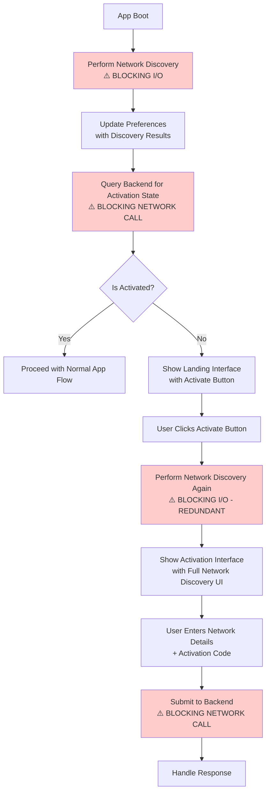
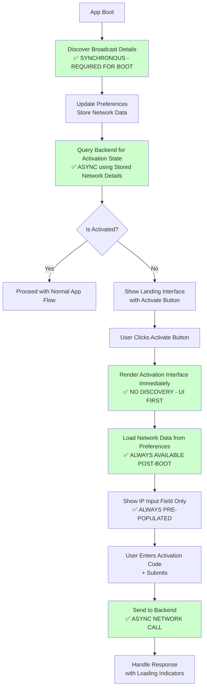

# Activation Flow Goal - Timestamp: 2026-01-12 20:09:07 UTC+3

## Overview
The activation flow from the Flutter app to the backend previously worked but is now taking an awfully long time (effectively not working). We suspect blocking I/O and network operations are hampering the flow.

## Desired Behavior

### On Boot Sequence:
1. **Discover Broadcast Details**: Find broadcast details from the server
2. **Update Preferences**: Store/update network preferences with discovered details
3. **Query Backend**: Use stored network details to query backend for active state of the system

### Activation State Check:
- **If Activated**: Proceed with normal app flow
- **If Not Activated**: Show landing interface with activate button

### Activation Interface Flow:
1. **On Activate Button Click**: Render activation interface
2. **Skip Discovery**: Do NOT perform new network discovery
3. **Load Network Data**: Use previously stored network data from preferences
4. **IP Input Only**: Show activation view with IP input field (pre-populated if available)
5. **Submit Activation Code**: When activation code is submitted, send action to backend

## Key Optimizations Needed:
- Eliminate blocking I/O operations
- Optimize network operations
- Ensure smooth, responsive UI during activation flow
- Prevent unnecessary network discovery retries
- Use cached/preference-stored network details efficiently

## Success Criteria:
- Fast boot-to-activation-check time
- Responsive UI during activation process
- Reliable backend communication using stored network details
- No unnecessary blocking operations

## Implementation Flowcharts

### Current State (Problematic Implementation)

### Desired State (Optimized Implementation)

