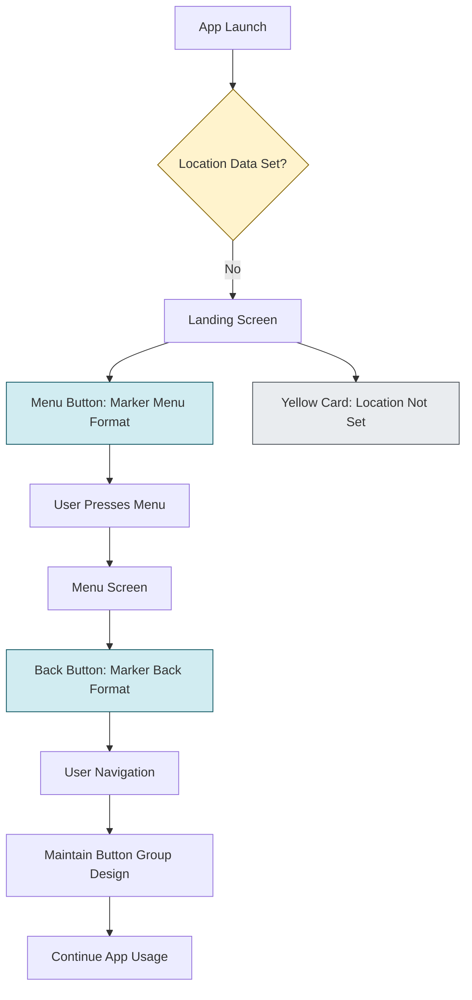
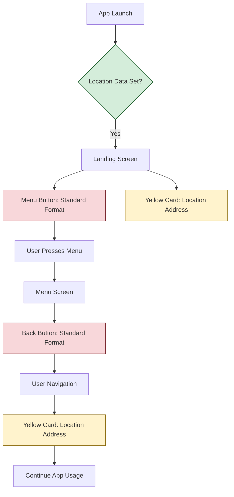
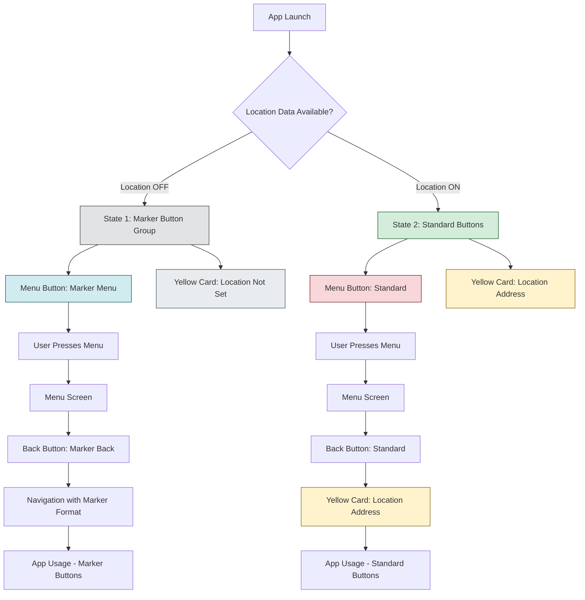
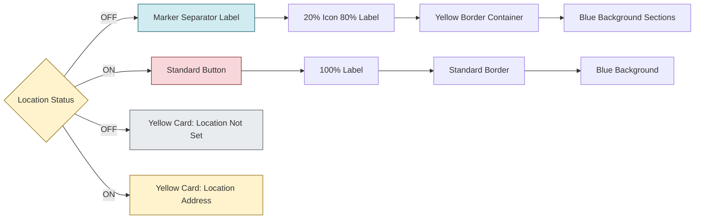
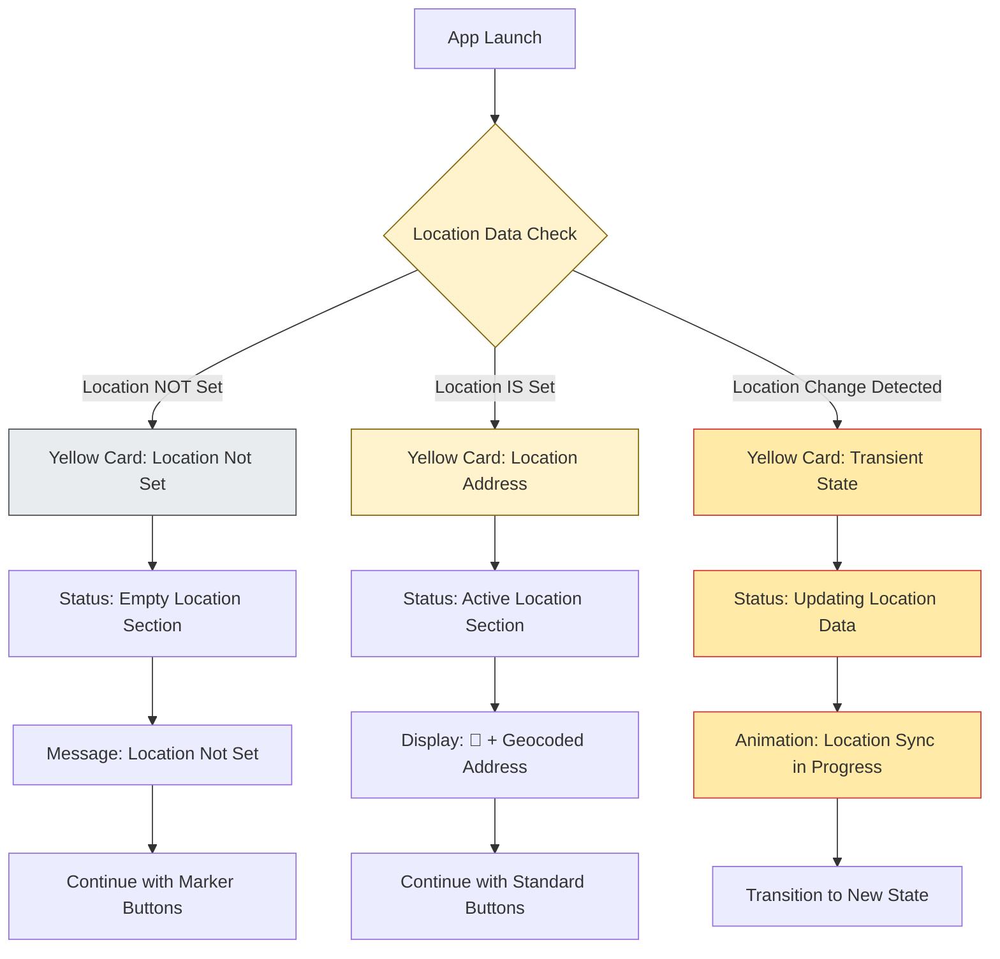

# Location Data UX/UI Integration - APK Interface & Backend Server Interfacing

**Date:** January 23, 2026, 1:22:12 AM (Africa/Nairobi, UTC+3:00)
**Timestamp:** 20260123_012212

## Overview
Integration of location data functionality into the BluPOS APK interface with dynamic UX changes based on location data availability. The implementation includes backend server interfacing for location data persistence and geocoding integration.

## Location Data States

### State 1: Location Data NOT Set (Default/Initial State)

#### Visual Description - Landing Interface Menu Button:
```
┌─────────────────────────────────────────────────────────────┐
│  📍    │━━━━━━━━━━━━━━━━━━━━━━━━━━━━━━━━━━━━━━━━━━━━━━━━━━━│  Menu    │
└─────────────────────────────────────────────────────────────┘
```
- **Overall Structure**: Single row button group with yellow rounded border matching card component
- **Left Section (20%)**: Google Material location icon (📍) in white on blue background
- **Middle Section**: Vertical yellow separator line (━━━━━━━━━━━━━━━━━━━━━━━━━━━━━━━━━━━━━━━━━━━━━━━━━━━)
- **Right Section (80%)**: "Menu" label text in white on blue background
- **Background**: Blue gradient background across icon and label sections
- **Border**: Yellow rounded border (8px radius) similar to yellow card interface
- **Height**: Same as existing menu button (67.5px - 35% increased)

#### Visual Description - Menu Interface (When Pressed Without Location):
```
┌─────────────────────────────────────────────────────────────┐
│  📍    │━━━━━━━━━━━━━━━━━━━━━━━━━━━━━━━━━━━━━━━━━━━━━━━━━━━│  Back    │
└─────────────────────────────────────────────────────────────┘
```
- **Same structure as landing interface** but with "Back" label instead of "Menu"
- **Persisted design**: Maintains the button group format throughout menu navigation
- **No location functionality**: Clicking marker or any part triggers navigation only

### State 2: Location Data IS Set (Active State)

#### Visual Description - Landing Interface Menu Button:
```
┌─────────────────────────────────────────────────────────────┐
│                                                             │
│                    Menu                                     │
└─────────────────────────────────────────────────────────────┘
```
- **Structure**: Standard button (no marker/separator)
- **Width Allocation**: 100% for menu label (no 20:80 split)
- **Marker Hidden**: Location marker completely hidden
- **Background**: Standard blue gradient
- **Border**: Standard rounded corners

#### Visual Description - Menu Interface (When Pressed With Location):
```
┌─────────────────────────────────────────────────────────────┐
│                                                             │
│                    Back                                     │
└─────────────────────────────────────────────────────────────┘
```
- **Same structure as landing interface** with "Back" label
- **No marker elements**: Clean button design
- **Standard navigation**: Back functionality only

#### Visual Description - Yellow Card Interface (Location Active):
```
┌─────────────────────────────────────────────────────────────┐
│  Device ID: ABC123                    14:30                 │
│                                                             │
│          📍 Nairobi, Kenya - Westlands                     │
│                                                             │
│  Total Processed                                            │
│  [SMS Indicator Animation]                                  │
│                                                             │
│  Active                                 12/31/2026         │
└─────────────────────────────────────────────────────────────┘
```
- **Location Marker**: Google Material location icon (📍) in white on blue background
- **Address Display**: Geocoded address at middle-right-end of same horizontal axis
- **Geocoding Data**: Uses Android Geocoder.getFromLocation() API
- **Address Fields**: Displays relevant location data (locality, admin area, country)
- **Layout**: Marker and address share the horizontal space before "Total Processed" section

#### Visual Description - Yellow Card Interface (Location NOT Set):
```
┌─────────────────────────────────────────────────────────────┐
│  Device ID: ABC123                    14:30                 │
│                                                             │
│  Location Not Set                                           │
│  [SMS Indicator Animation]                                  │
│                                                             │
│  Active                                 12/31/2026         │
└─────────────────────────────────────────────────────────────┘
```
- **No Location Marker**: Empty space where location would be displayed
- **Status Text**: "Location Not Set" message in place of geocoded address
- **SMS Indicator**: Continues to function normally regardless of location status
- **Device Information**: Device ID and timestamp remain unchanged
- **Layout**: Maintains consistent card structure with location section empty

## Technical Implementation Details

### Location Data Storage
- **Local APK Storage**: SharedPreferences for lat/long coordinates
- **Backend Sync**: Location data sent to server on activation/sync
- **Persistence**: Location data survives app restarts

### Geocoding Integration
- **Android API**: `Geocoder.getFromLocation(latitude, longitude, maxResults)`
- **Address Object Fields**:
  - `getAddressLine(0)` - Full address line
  - `getLocality()` - City/Town
  - `getAdminArea()` - State/Province
  - `getCountryName()` - Country
- **Fallback**: Handle geocoding failures gracefully

### State Management
- **Location Check**: Verify lat/long existence in SharedPreferences
- **UI Updates**: Dynamic button group construction based on location state
- **Real-time Updates**: Location changes trigger immediate UI updates

### Backend Server Integration
- **Location Endpoints**:
  - `POST /api/location/update` - Store device location
  - `GET /api/location/get` - Retrieve stored location
- **Data Format**: JSON with latitude, longitude, timestamp
- **Sync Timing**: Location updates on app start and periodic sync

## UX Flow Diagrams

### Location Not Set Flow:
```
App Launch → Check Location → Location NOT Set
    ↓
Landing Screen → Menu Button (📍|Menu format)
    ↓
Menu Press → Menu Screen → Back Button (📍|Back format)
    ↓
Navigation → Maintain button group design
```

### Location Set Flow:
```
App Launch → Check Location → Location IS Set
    ↓
Landing Screen → Menu Button (Standard format - no marker)
    ↓
Menu Press → Menu Screen → Back Button (Standard format)
    ↓
Yellow Card → Display 📍 + Geocoded Address
```

### Mermaid Flowcharts

#### Location OFF State Flow


#### Location ON State Flow


#### Complete Location State Flow with Transient States


#### Button Morphing Logic with Yellow Card States


#### Transient State Flow for Yellow Card Interface


## Implementation Requirements

### APK Changes:
1. **Location Service Integration**: Android location permissions and services
2. **Geocoding Service**: Address resolution from coordinates
3. **Dynamic UI Components**: Conditional rendering based on location state
4. **Button Group Widget**: Custom widget for marker + separator + label layout

### Backend Changes:
1. **Location API Endpoints**: Store/retrieve location data
2. **Database Schema**: Location table with device_id, lat, long, timestamp
3. **Validation**: Coordinate bounds and timestamp checks

### Permission Requirements:
- **Android Manifest**: `ACCESS_FINE_LOCATION`, `ACCESS_COARSE_LOCATION`
- **Runtime Permissions**: Location permission requests
- **User Consent**: Clear location data usage explanation

## Testing Scenarios

### Scenario 1: Fresh Install (No Location)
1. Install app → No location data
2. Landing screen → Menu button shows marker + separator + "Menu"
3. Press menu → Menu screen → Back button shows marker + separator + "Back"
4. Yellow card → No location indicator

### Scenario 2: Location Set
1. App with stored location data
2. Landing screen → Menu button shows standard format (no marker)
3. Press menu → Menu screen → Back button shows standard format
4. Yellow card → Shows 📍 marker + geocoded address

### Scenario 3: Location Revoked
1. User disables location → App detects change
2. UI switches to marker + separator format
3. Yellow card hides location indicator

## Performance Considerations

- **Geocoding Caching**: Cache geocoded addresses to avoid repeated API calls
- **Network Efficiency**: Only geocode when location changes significantly
- **Battery Optimization**: Use location updates sparingly
- **Error Handling**: Graceful degradation when geocoding fails

## Security & Privacy

- **Data Encryption**: Location data encrypted in storage and transit
- **User Control**: Clear location data deletion options
- **Transparency**: Location usage clearly communicated to users
- **Compliance**: GDPR and local privacy regulation compliance
