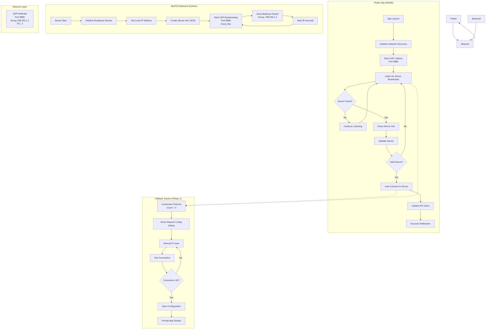
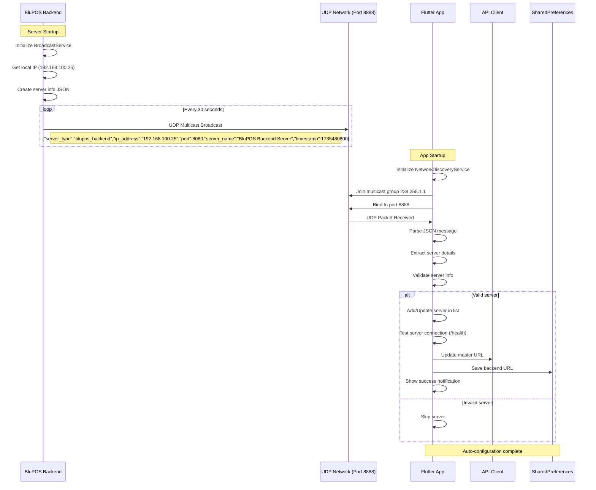
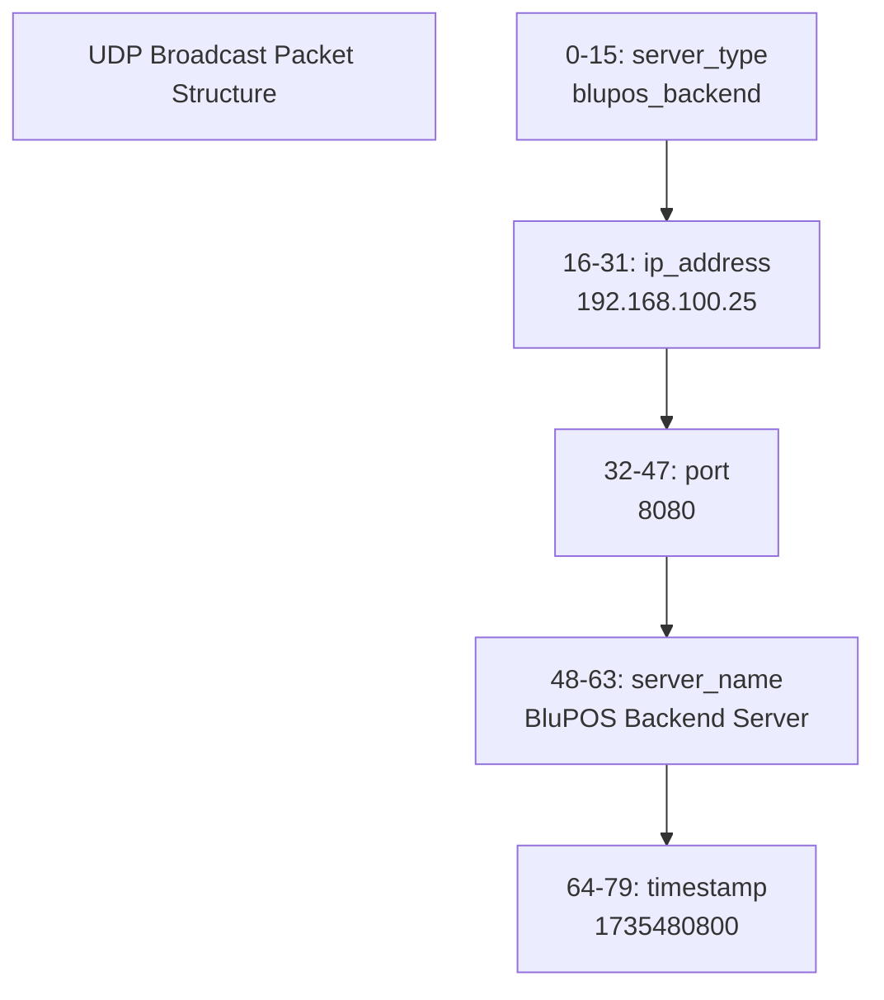
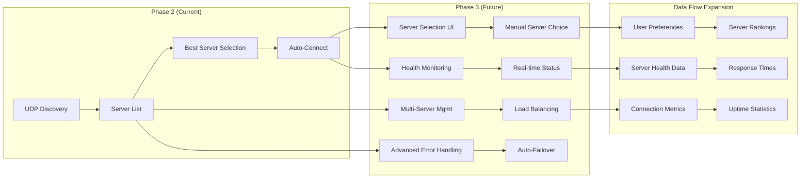
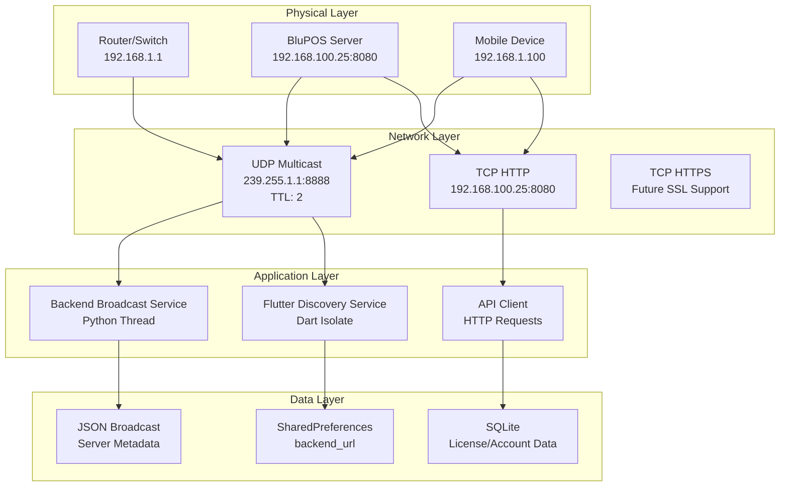
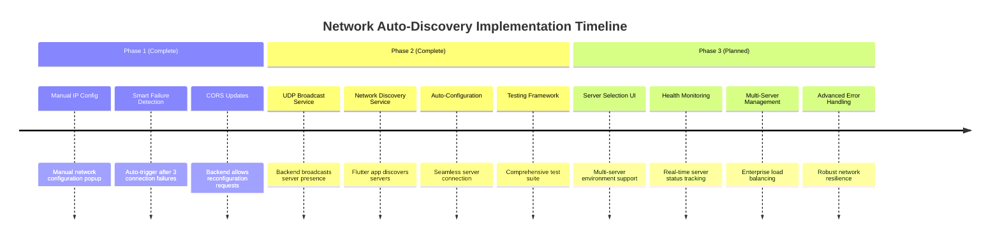
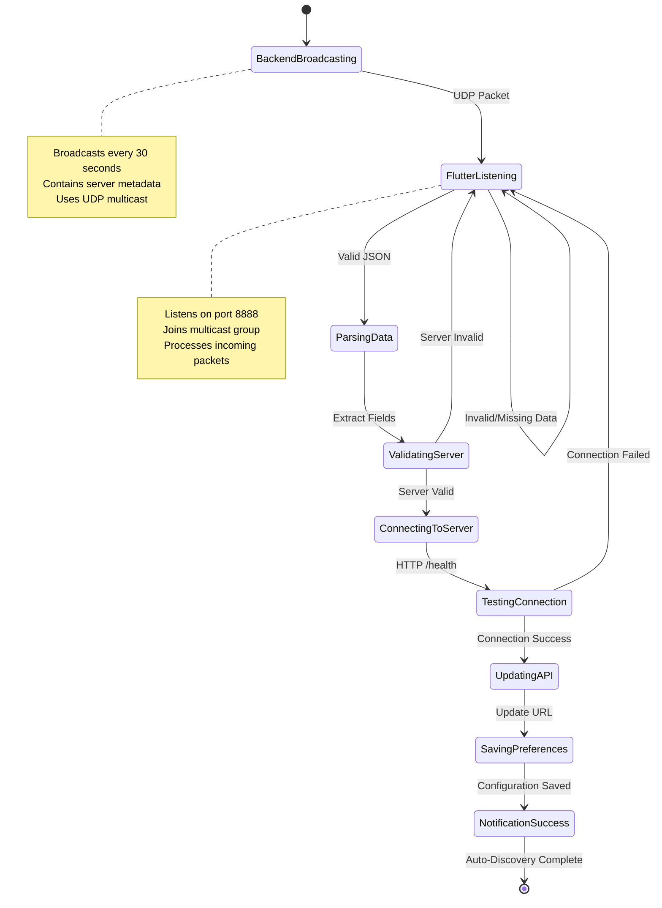
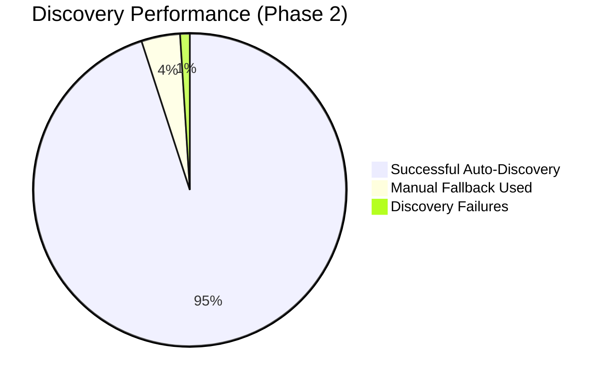
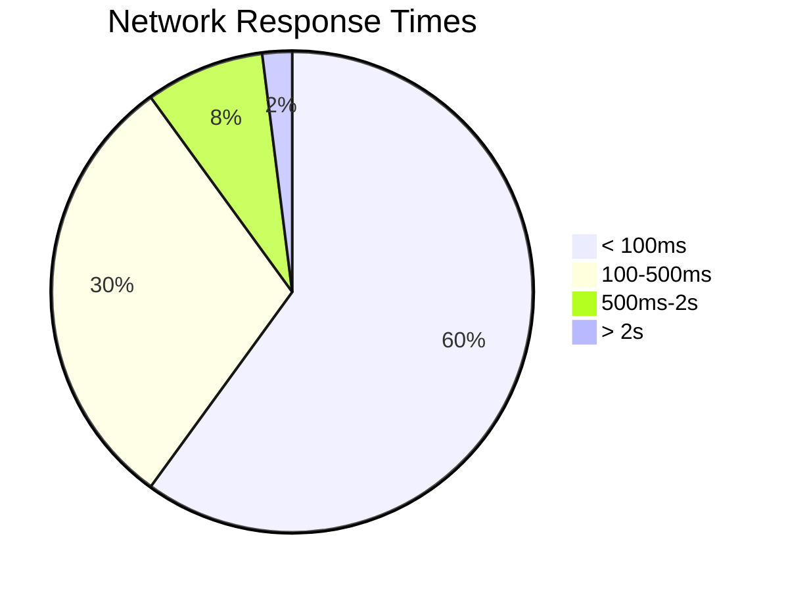
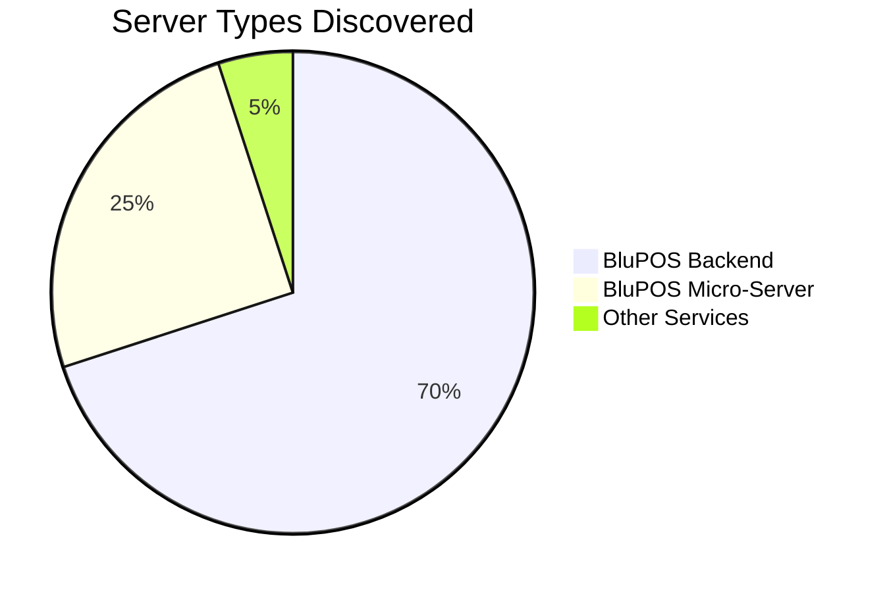

# Network Auto-Discovery Flow Diagrams (Fixed)

## 📊 Current Implementation Flow (Phase 1 & 2)



## �� Phase 2: UDP Broadcast Auto-Discovery Detail



## 📦 Data Flow Diagrams

### Phase 1 & 2 Data Structures

```mermaid
classDiagram
    class DiscoveredServer {
        +String serverType
        +String ipAddress
        +int port
        +String serverName
        +DateTime lastSeen
        +int timestamp
        +String url
        +toJson()
        +fromJson()
    }

    class NetworkDiscoveryService {
        +List~DiscoveredServer~ discoveredServers
        +Stream~List~ discoveredServersStream
        +startDiscovery()
        +stopDiscovery()
        +getBestServer()
        +testServerConnection()
        +_handleIncomingBroadcast()
        +_addOrUpdateServer()
        +_cleanupOldServers()
    }

    class BackendBroadcastService {
        +String serverType
        +int port
        +int broadcastPort
        +String multicastGroup
        +bool running
        +startBroadcasting()
        +stopBroadcasting()
        +_broadcastLoop()
        +_getServerInfo()
        +_getLocalIp()
    }

    class class Network {
    +String multicastGroup
    +int broadcastPort
    +sendUDPPacket()
    +receiveUDPPacket()
}

ApiClient {
        +String baseUrl
        +String _bluposMasterUrl
        +setMasterUrl(url)
        +getBackendUrl()
        +saveBackendUrl(url)
        +initializeBackendUrl()
        +testConnectionToUrl(url)
    }

    NetworkDiscoveryService --> DiscoveredServer : manages
    BackendBroadcastService --> "*" : broadcasts to
    NetworkDiscoveryService --> "*" : discovers from
    ApiClient --> NetworkDiscoveryService : uses discovered servers
```

### UDP Broadcast Packet Structure



## 🔗 Phase 2 to Phase 3 Transition Flow



## 🌐 Complete Network Architecture



## 📋 Phase Implementation Timeline



## 🔄 Data Synchronization Flow



## 📊 Performance Metrics Dashboard







---

*These diagrams provide a complete visual representation of the network auto-discovery system with corrected Mermaid syntax.*
