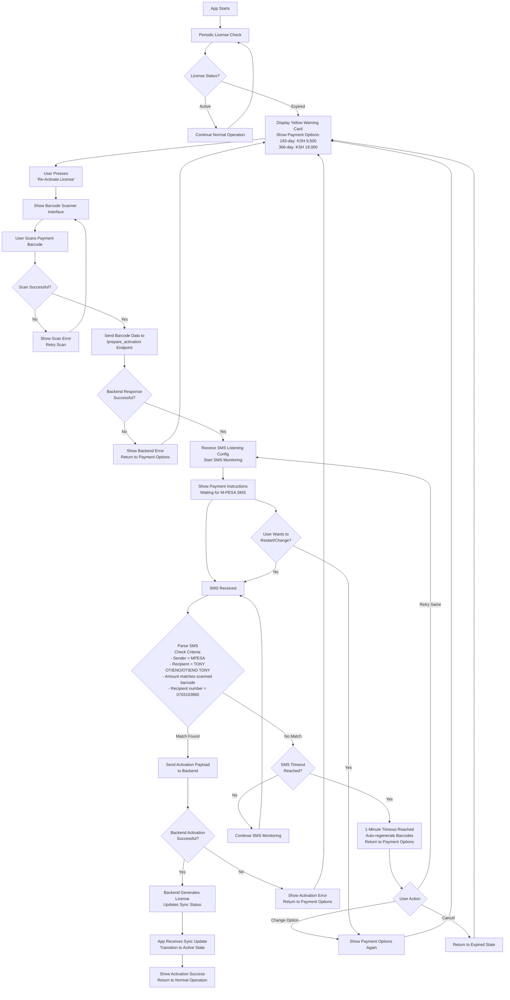

# Re-Activation with Payment Flow Plan
**Timestamp:** 2026-01-20 20:58:51 UTC+3:00

## Overview
This document outlines the revised re-activation flow for the BluPOS app. The current system requires app pairing for backend activation, but we need to implement a payment-based re-activation mechanism that handles expired licenses automatically and provides seamless payment processing through barcode scanning and SMS verification.

## Current System Context
- App pairs with backend to enable data infrastructure access
- Re-activation currently shows activation page
- No automated expired state detection in app
- No payment integration for license renewal

## Revised Re-Activation Goals

### Goal 1: Automated Expired State Detection and Payment Options
**Requirement:** When license reaches expired state, app should automatically reflect this condition.

**Implementation:**
- App should poll backend for license status periodically
- When expired state detected, display yellow warning card
- Generate two payment barcodes below yellow card, above re-activate button:
  - 183-day license renewal barcode
  - 366-day license renewal barcode
- Each barcode should be preceded by payment type description with matching amounts

**UI Changes (Integrated with Master Interface):**

**Current Expired State (Before Changes):**
```
[YELLOW CARD - EXPIRED LICENSE]
[Account ID] [Network Time]
[Total Processed: SMS Indicator]
[License Status: Expired] [Expiry: --/--/----]

[GREEN REACTIVATE BUTTON]
```

**Updated Expired State (After Changes):**
```
[YELLOW CARD - EXPIRED LICENSE]
[Account ID] [Network Time]
[Total Processed: SMS Indicator]
[License Status: Expired] [Expiry: --/--/----]

Payment Options:

**183-Day License Renewal**
*Amount: KSH 9,500*
[BARCODE: 183_DAYS_9500]

**366-Day License Renewal**
*Amount: KSH 19,000*
[BARCODE: 366_DAYS_19000]

⚠️ Only full payment amounts accepted - no partial payments

[GREEN REACTIVATE BUTTON]
```

**Detailed Interface State Transitions (Same Yellow Card Context):**

1. **Scanning State (Yellow Card Transforms):**
   ```
   [YELLOW CARD - SCAN PAYMENT]
   [Account ID] [Network Time]
   [Camera Interface - Barcode Scanner]
   [SCAN BUTTON]
   ```

2. **Payment Processing State:**
   ```
   [YELLOW CARD - PROCESS PAYMENT]
   [Account ID] [Network Time]
   [... SMS ICON ... Animation]
   [PROCESS BUTTON]
   ```

3. **Activation Data State:**
   ```
   [YELLOW CARD - ACTIVATION READY]
   [Account ID] [Network Time]
   [Justified Centered Text Content - License Details]
   [ACTIVATE BUTTON]
   ```

4. **Final Connected State:**
   ```
   [YELLOW CARD - ACTIVATED]
   [Account ID] [Network Time]
   [Activation Data Display]
   [MORPHING BUTTON: CONNECT ↔ PRINT]
   ```

### Goal 2: Barcode Scanning Interface for Re-Activation
**Requirement:** Re-activate button should trigger barcode scanning instead of showing activation page.

**Implementation:**
- Modify re-activate button to open phone camera for barcode scanning
- Scanned barcode should contain payment information
- App sends scanned data to new backend endpoint: `/prepare_activation`
- Endpoint returns payload instructing app to setup SMS listening for M-PESA payment

**Flow:**
1. User presses "Re-Activate License"
2. Yellow card transforms to show barcode scanner interface
3. User scans payment barcode
4. App calls `/prepare_activation` with scanned code
5. Backend returns SMS listening configuration
6. App begins monitoring SMS for matching payment

**Restart Capability:**
- Allow users to restart the process midway if they change their mind about license duration
- Provide a "Change Option" or "Restart" button during the scanning/payment waiting phase
- Reset SMS listening when user chooses to restart
- Allow switching between 183-day and 366-day options before payment completion

**SMS Matching Criteria:**
- Payment must be made to: 0703103960
- SMS sender must match "MPESA"
- Recipient name must match "TONY OTIENO" or "OTIENO TONY" (uppercase)
- Amount must match scanned barcode amount (exact match only - no partial payments accepted)

**SMS Listening Timeout:**
- 1-minute timeout period after barcode scan
- Auto-regenerate barcodes if timeout reached
- Return to payment options interface

**Sample SMS Format:**
```
TJEX57F0O2 Confirmed. Ksh500.00 sent to JANE DOE 0703103960 on 14/10/25 at 8:50 PM. New M-PESA balance is Ksh1.43. Transaction cost, Ksh0.00. Amount you can transact within the day is 499,950.00. Earn interest daily on Ziidi MMF,Dial *334#
```

**Key Matching Rules:**
- `sender == "MPESA"`
- `recipient_name in ["TONY OTIENO", "OTIENO TONY"]`
- `amount == scanned_amount`

### Goal 3: Successful Payment Activation and Backend Sync
**Requirement:** Upon successful payment verification, activate both app and backend simultaneously.

**Implementation:**
- App detects matching SMS
- Sends activation payload to backend
- Backend generates and activates license
- Due to existing sync mechanism, app automatically reflects activated state

**Activation Flow:**
1. SMS received and matched
2. App sends activation payload to backend
3. Backend processes activation (generates license, updates status)
4. Backend sync updates app state automatically
5. App transitions from expired to active state

## Technical Implementation Plan

### Backend Changes
1. **New Endpoint:** `/prepare_activation`
   - Accepts scanned barcode data
   - Returns SMS listening configuration
   - Payload format: `{"listen_for": {"amount": 500, "recipient": "TONY OTIENO"}}`

2. **SMS Service Enhancement:**
   - Integrate with existing SMS listening infrastructure
   - Add payment verification logic
   - Support multiple concurrent payment listeners

3. **License Management:**
   - Update license generation for payment-based activation
   - Support 183-day and 366-day license periods
   - Maintain backward compatibility with existing pairing system

### App Changes (Flutter)
1. **License Status Monitoring:**
   - Implement periodic license status checks
   - Update UI state based on backend response

2. **Barcode Generation:**
   - Generate payment barcodes for different license periods
   - Include payment amounts and license types

3. **Barcode Scanning:**
   - Integrate camera permission and barcode scanning
   - Process scanned data for payment preparation

4. **SMS Listening:**
   - Implement SMS monitoring for payment confirmation
   - Parse and validate M-PESA SMS format

5. **UI State Management:**
   - Handle expired/active state transitions
   - Update yellow card content dynamically

### Security Considerations
- Validate barcode data integrity
- Secure SMS parsing and matching
- Rate limiting for activation attempts
- Audit trail for payment transactions

### Testing Requirements
- Unit tests for SMS parsing logic
- Integration tests for barcode scanning
- End-to-end payment flow testing
- Edge cases: invalid payments, network failures, SMS parsing errors

## Re-Activation Flowchart



## Implementation Decisions (Answered)
- ✅ **Payment Amounts:** 183-day license = KSH 9,500, 366-day license = KSH 19,000
- ✅ **Payment Policy:** No partial payments - only exact amount matching accepted (caution displayed on both interfaces)
- ✅ **Failed Payment Handling:** Restore everything to initial re-activation UX state
- ✅ **SMS Listening Timeout:** 1 minute timeout, then auto-regenerate barcodes
- ✅ **Payment Retry Mechanisms:** Deemed redundant per preceding specifications
