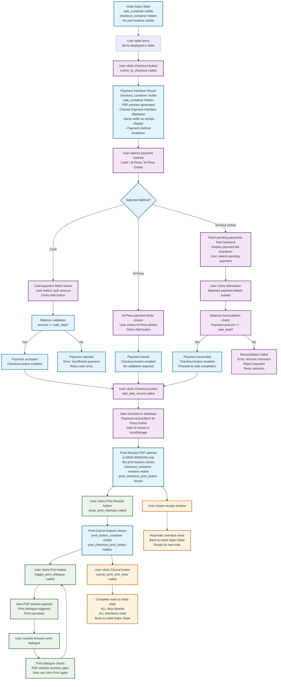

# Sales Management Flow Diagram - Timestamp: 2026-01-10 14:02

## Desired Flowchart for Sales Management Page - UPDATED 2026-01-10

This document outlines the exact desired flow for the sales management page, including checkout, printing, cancellation, and enhanced payment processing with M-Pesa online reconciliation.

## Key Requirements Summary - UPDATED

### 1. Checkout Flow
- **checkout button** → Show payment interface (same width as receipt display) + PDF preview
- **Payment methods**: Cash, M-Pesa, M-Pesa Online (NEW)
- **M-Pesa Online**: Fetches pending payments, exact amount match required for reconciliation

### 2. Payment Processing
- **Cash**: User enters amount, validation (amount >= sale_total)
- **M-Pesa**: User enters details, stored without validation
- **M-Pesa Online**: Select from pending payments list, backend reconciliation check

### 3. Reconciliation Logic (NEW)
- **Backend reconciliation** for M-Pesa Online payments
- **Amount matching**: Selected payment amount MUST equal sale total
- **Reconciliation success** → Proceed to sale completion
- **Reconciliation failure** → Reject with amount mismatch error

### 4. Print Flow (Separate Action)
- **"Print Receipt" button** → Shows print/cancel interface (after successful payment)
- **Print button** → Opens PDF in new window + triggers print
- **Cancel button** → Complete reset to initial sales state

### 5. Cancel Behavior
- **Cancel button** → Full reset (localStorage.clear, interface reset)
- **No pending interfaces** after cancel
- **Clean return** to initial sales input state

### 6. State Management
- **Initial State**: sale_container visible, clean interface
- **Checkout State**: checkout_container visible, payment processing + PDF preview
- **Payment Reconciliation**: M-Pesa Online balance validation
- **Post-Checkout State**: Receipt displayed, optional print button
- **Print State**: Print/cancel buttons visible
- **Reset State**: Back to initial, all data cleared

## Interface Elements Visibility - UPDATED

| State | sale_container | checkout_container | payment_interface | post_checkout_print_button | print_button_container |
|-------|----------------|-------------------|------------------|---------------------------|------------------------|
| Initial | ✅ Visible | ❌ Hidden | ❌ Hidden | ❌ Hidden | ❌ Hidden |
| Checkout | ❌ Hidden | ✅ Visible | ✅ Visible (full width) | ❌ Hidden | ❌ Hidden |
| Post-Checkout | ❌ Hidden | ✅ Visible | ❌ Hidden | ✅ Visible | ❌ Hidden |
| Print Active | ❌ Hidden | ✅ Visible | ❌ Hidden | ❌ Hidden | ✅ Visible |
| After Cancel | ✅ Visible | ❌ Hidden | ❌ Hidden | ❌ Hidden | ❌ Hidden |

## Payment Interface Layout (NEW)

### Choose Payment Section
- **Width**: Same as receipt display interface (50% of checkout container)
- **Components**:
  - Payment method dropdown: Cash / M-Pesa / M-Pesa Online
  - Dynamic fields based on selection
  - Add button for payment processing
  - Validation feedback

### M-Pesa Online Specifics
- **Dropdown population**: Fetched from `/get_pending_payments` endpoint
- **Selection**: User picks payment from list
- **Validation**: Amount must exactly match sale total
- **Backend reconciliation**: Automatic marking as reconciled on success

## Critical Points - UPDATED

1. **Payment interface width** - Same as receipt display for balanced layout
2. **M-Pesa Online reconciliation** - Exact amount matching required
3. **Backend integration** - Pending payments fetched and reconciled server-side
4. **Print flow separation** - Only accessible after successful payment
5. **Cancel = Full Reset** - No interface remnants, clean state transitions

## Implementation Requirements

### Frontend Changes
1. **HTML**: Add "M-Pesa Online" option to payment method dropdown
2. **CSS**: Adjust payment interface width to match receipt display
3. **JavaScript**:
   - Fetch pending payments for M-Pesa Online dropdown
   - Implement reconciliation validation logic
   - Update payment processing flow

### Backend Changes
1. **API Endpoint**: `/get_pending_payments` for fetching unreconciled payments
2. **Reconciliation Logic**: Mark payments as reconciled when matched to sales
3. **Database Updates**: Update payment status and link to sale records

## Current Issues to Fix - UPDATED

1. **Payment interface width** - Currently doesn't match receipt display width
2. **Missing M-Pesa Online option** - Only Cash and M-Pesa currently available
3. **No pending payments fetching** - Backend integration missing
4. **No reconciliation validation** - Amount matching logic not implemented
5. **Pending interface elements** - Some elements still not properly hidden
6. **Incomplete state resets** - Cancel function needs updates for new payment flow

This diagram serves as the blueprint for implementing the correct sales management flow.
