# SMS Infrastructure Flowcharts

## Overview

This document contains comprehensive Mermaid flowcharts documenting the SMS payment verification and synchronization system, including the current broken flow and the proposed fixed flow using auto-discovery.

## Current SMS Flow (Broken)

### Broken SMS Processing Flow
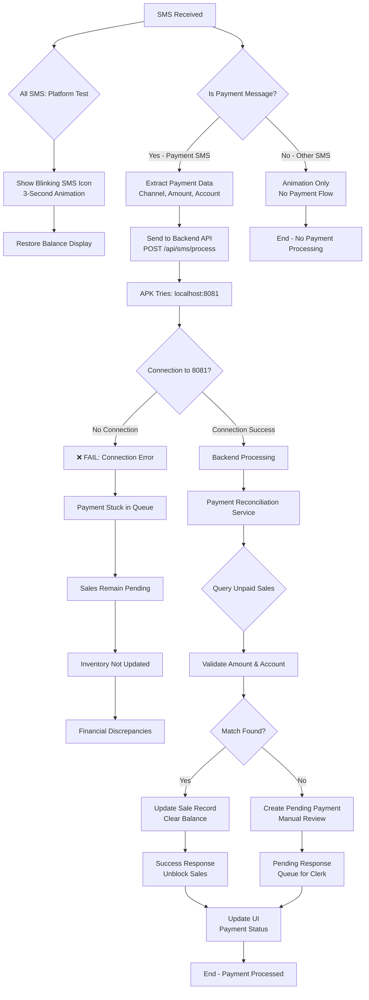

### Current Port Configuration Issues
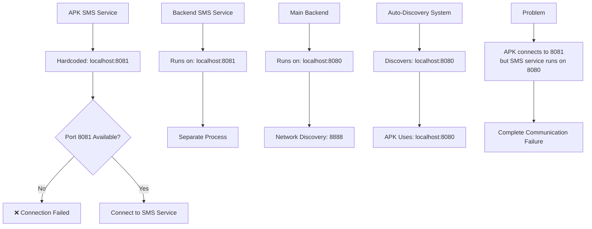

## Proposed Fixed SMS Flow (With Auto-Discovery)

### Fixed SMS Processing Flow
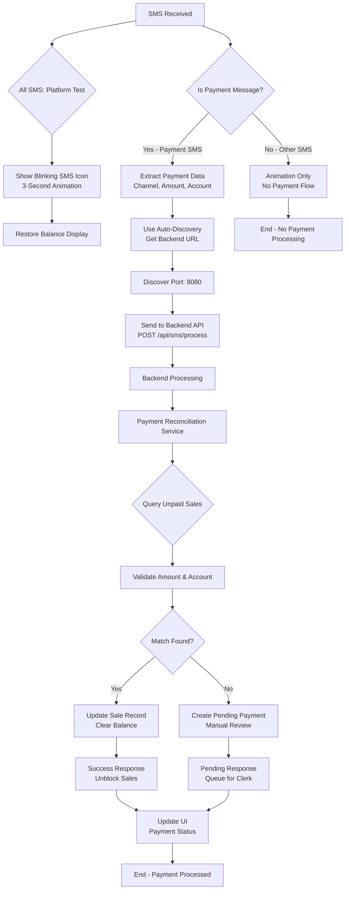

### Auto-Discovery Integration Flow
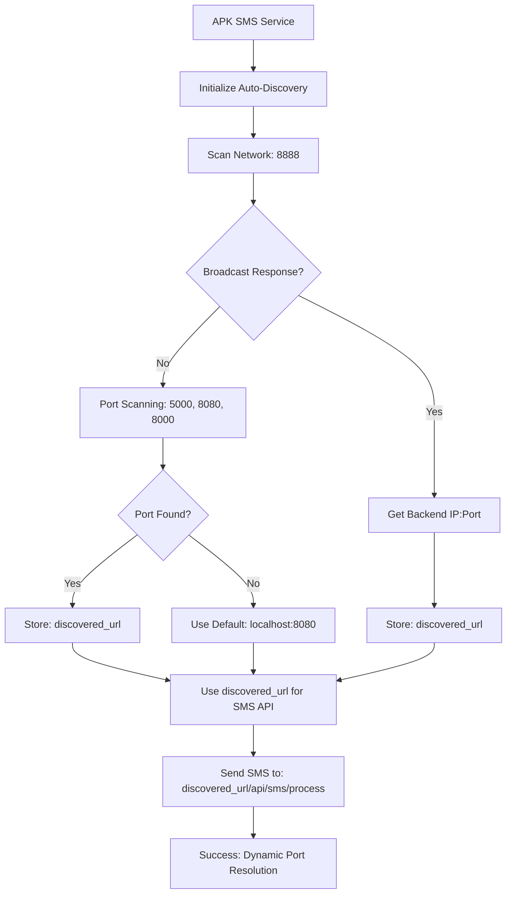

### Unified Service Architecture
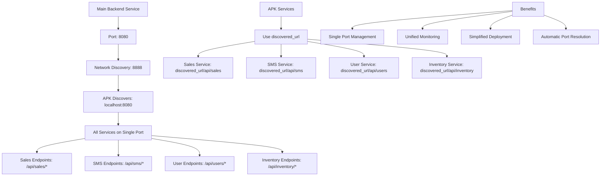

## SMS Payment Reconciliation Flow

### Enhanced Reconciliation with Payment Queue
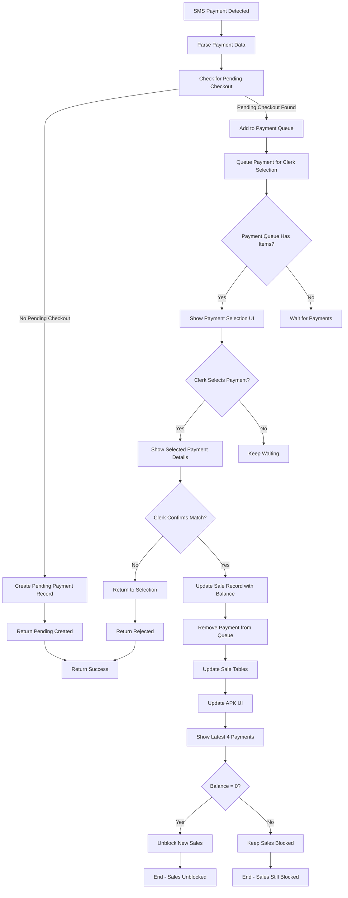

### Payment Queue Management
```mermaid
graph TD
    A[Payment Queue] --> B[Queue Entry Structure]
    B --> C[Payment ID]
    B --> D[Payment Data]
    B --> E[Pending Checkout Info]
    B --> F[Received Time]
    B --> G[Status]
    
    H[Queue Operations] --> I[Add Payment]
    H --> J[Select Payment]
    H --> K[Confirm Payment]
    H --> L[Reject Payment]
    H --> M[Clear Queue]
    
    I --> N[Generate Unique ID]
    I --> O[Store Payment Data]
    I --> P[Link to Pending Checkout]
    I --> Q[Set Status: queued]
    
    J --> R[Find Payment by ID]
    J --> S[Return Payment Details]
    J --> T[Return Pending Checkout]
    
    K --> U[Validate Payment Match]
    K --> V[Update Sale Record]
    K --> W[Remove from Queue]
    K --> X[Update Status: reconciled]
    
    L --> Y[Remove from Queue]
    L --> Z[Set Status: rejected]
    
    M --> AA[Clear All Payments]
    M --> BB[Reset Queue Length]
```

## Database Schema Relationships

### Enhanced Sale Record with Blocking Status
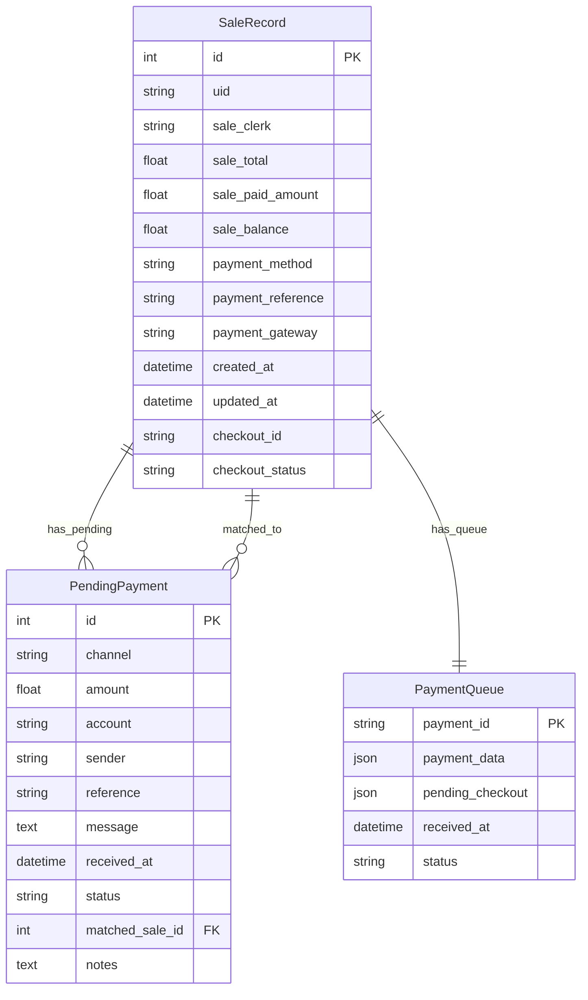

### Payment Flow State Transitions
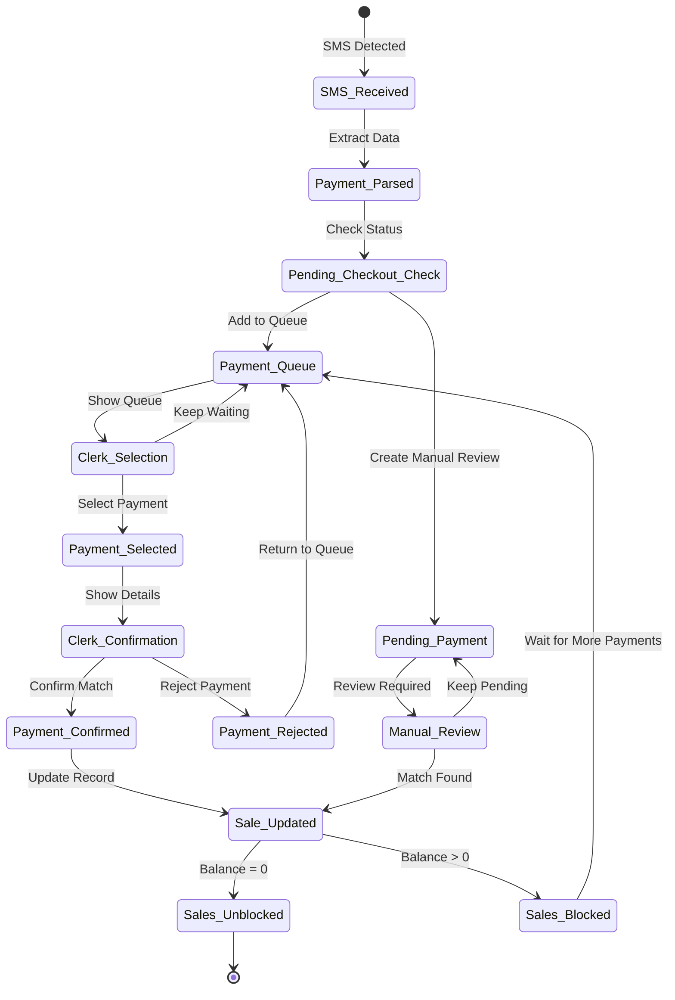

## Auto-Discovery Service Architecture

### Network Discovery Flow
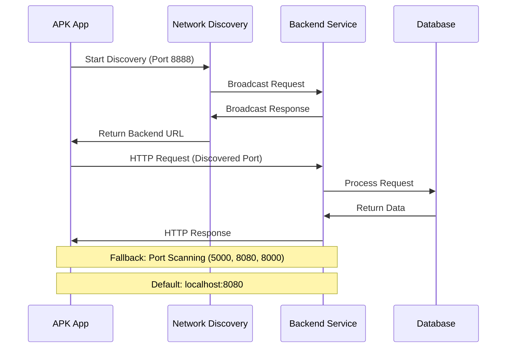

### Service Integration Architecture
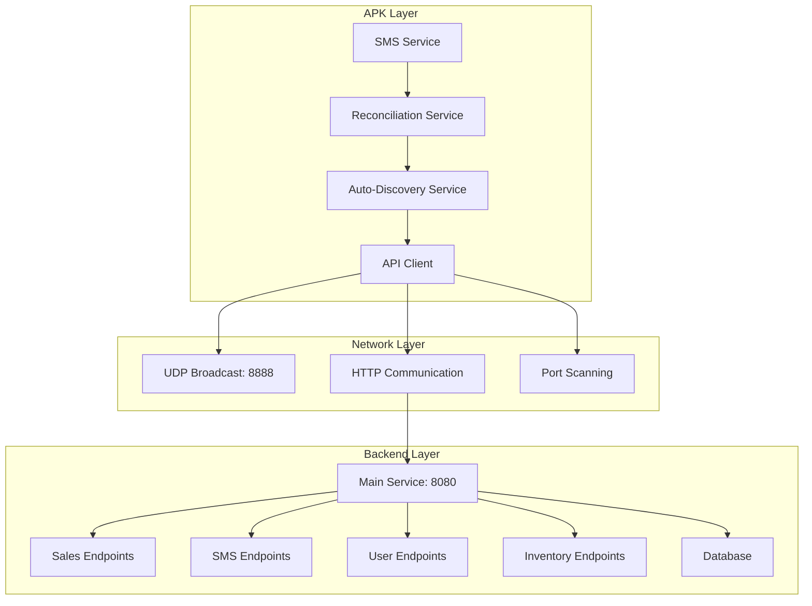

## Error Handling and Recovery

### Error Recovery Flow
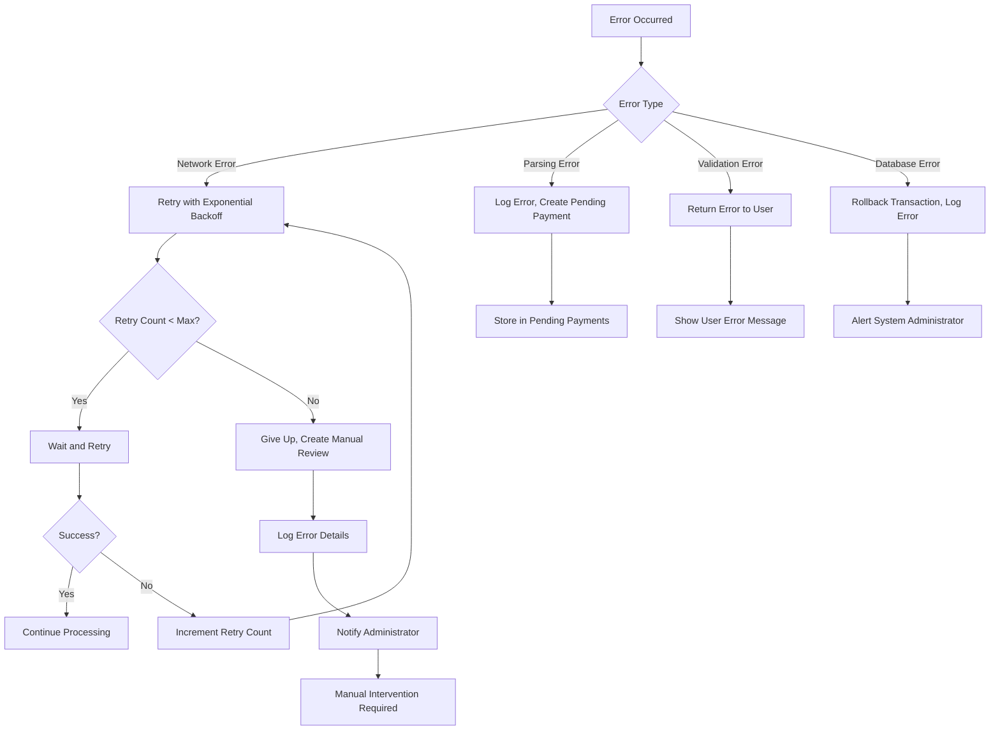

### Service Health Monitoring
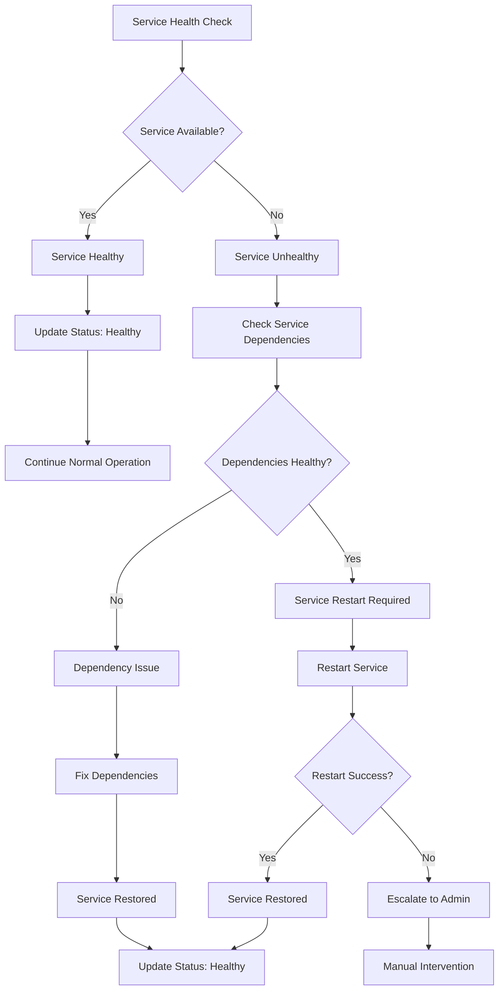

## Performance Optimization

### Caching Strategy
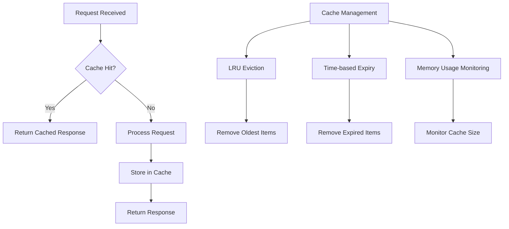

### Load Balancing Strategy
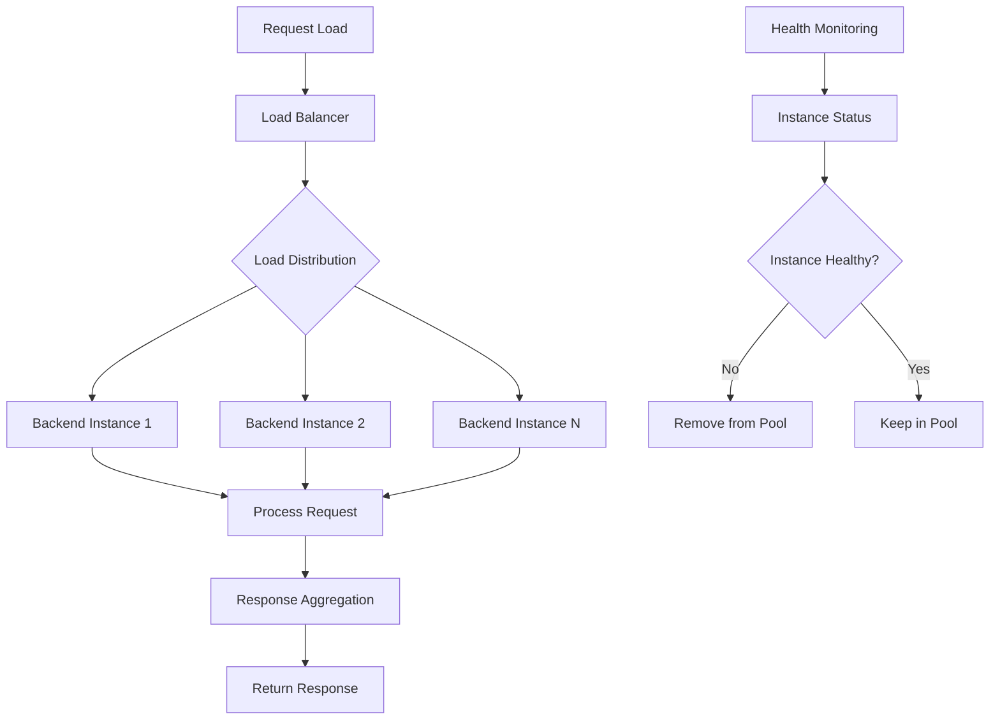

These flowcharts provide a comprehensive view of the SMS infrastructure, highlighting the current issues and the proposed solutions using auto-discovery to create a robust, scalable, and maintainable SMS payment verification system.
