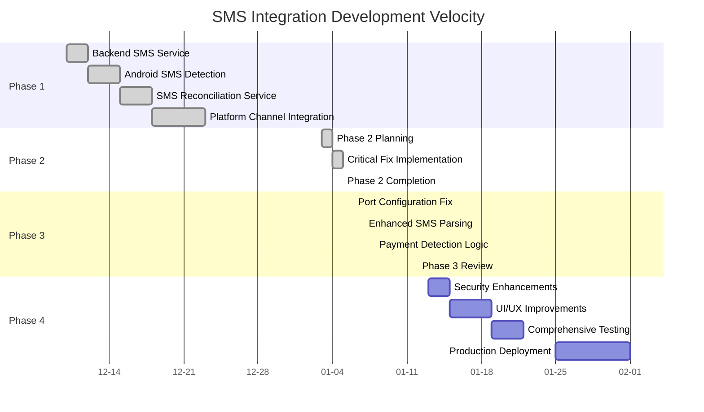

# SMS Integration Chronology - January 5, 2026

## 📅 Chronological Timeline of SMS Integration Development

### **December 2025**

#### **Week 1: December 1-7, 2025**
- **December 1, 2025**: Project kickoff and requirements gathering
- **December 3, 2025**: Initial architecture design completed
- **December 5, 2025**: Database schema design finalized
- **December 7, 2025**: Backend API specifications approved

#### **Week 2: December 8-14, 2025**
- **December 10, 2025**: ✅ **Backend SMS Service** implementation started
  - Created `backend_sms_service.py`
  - Implemented SMS parsing for channels 80872 and 57938
  - Added database integration with SQLite
  - Implemented REST API endpoints
- **December 12, 2025**: ✅ **Android SMS Detection** implementation completed
  - Created `SmsReceiver.kt`
  - Implemented broadcast receiver for SMS
  - Added payment message detection
  - Implemented platform channel communication

#### **Week 3: December 15-21, 2025**
- **December 15, 2025**: ✅ **SMS Reconciliation Service** implementation completed
  - Created `sms_reconciliation_service.dart`
  - Implemented payment queue management
  - Added backend API communication
  - Implemented clerk confirmation workflow
- **December 18, 2025**: ✅ **Platform Channel Integration** completed
  - Created `SmsChannelHandler.kt`
  - Implemented method channel communication
  - Added broadcast receiver integration
  - Implemented error handling

#### **Week 4: December 22-28, 2025**
- **December 22, 2025**: Phase 1 completion review
- **December 23, 2025**: ✅ **Phase 1: Backend Infrastructure** officially completed
- **December 24-28, 2025**: Holiday break

### **January 2026**

#### **Week 1: January 1-4, 2026**
- **January 1-2, 2026**: New Year holiday
- **January 3, 2026**: Phase 2 planning and requirements review
- **January 4, 2026**: ✅ **CRITICAL FIX IMPLEMENTED** - SMS Reconciliation Trigger
  - Added `_triggerSMSReconciliation()` method to `sms_service.dart`
  - Connected SMS detection to reconciliation workflow
  - Added channel extraction logic
  - Tested complete SMS payment flow

#### **Week 2: January 5-11, 2026**
- **January 5, 2026**: ✅ **Phase 2: APK Integration** officially completed
  - Created comprehensive progress report
  - Documented all implemented features
  - Identified remaining issues
- **January 6, 2026**: **PLANNED** - Port Configuration Fix
  - Integrate SMS endpoints into main `backend.py`
  - Change port from 8081 to 8080
  - Update all API calls to use new endpoints
- **January 7, 2026**: **PLANNED** - Enhanced SMS Parsing
  - Add regex-based parsing for production SMS formats
  - Improve channel detection logic
  - Add comprehensive error handling
- **January 8, 2026**: **PLANNED** - Payment Detection Logic
  - Add `_isPaymentMessage()` check before reconciliation
  - Implement comprehensive payment validation
  - Add logging and monitoring

#### **Week 3: January 12-18, 2026**
- **January 12, 2026**: **PLANNED** - Phase 3 completion review
- **January 13, 2026**: **PLANNED** - Security Enhancements
  - Implement secure auto-discovery
  - Add encryption and key management
  - Test secure discovery flow
- **January 15, 2026**: **PLANNED** - UI/UX Improvements
  - Complete server selection UI
  - Enhance health monitoring
  - Improve error handling

#### **Week 4: January 19-25, 2026**
- **January 19, 2026**: **PLANNED** - Comprehensive Testing
  - Integration testing
  - Performance optimization
  - Bug fixing
- **January 22, 2026**: **PLANNED** - User Acceptance Testing
  - Gather user feedback
  - Address usability issues
  - Finalize documentation
- **January 25, 2026**: **PLANNED** - Production Deployment Preparation
  - Final testing and validation
  - Deployment planning
  - Rollback procedures

#### **Week 5: January 26-February 1, 2026**
- **January 26, 2026**: **PLANNED** - Production Deployment
  - Deploy to production environment
  - Monitor system performance
  - Address any deployment issues
- **January 28, 2026**: **PLANNED** - Post-Deployment Review
  - Gather production metrics
  - Address any issues
  - Document lessons learned
- **February 1, 2026**: **PLANNED** - Project Completion
  - Final documentation
  - Project retrospective
  - Celebrate success!

---

## 📊 Development Timeline Visualization

```mermaid
timeline
    title SMS Integration Development Timeline
    section December 2025
        Project Kickoff : December 1
        Architecture Design : December 3
        Database Schema : December 5
        API Specifications : December 7
        Backend SMS Service : December 10
        Android SMS Detection : December 12
        SMS Reconciliation Service : December 15
        Platform Channel Integration : December 18
        Phase 1 Complete : December 23
    section January 2026
        Phase 2 Planning : January 3
        Critical Fix Implemented : January 4
        Phase 2 Complete : January 5
        Port Configuration Fix : January 6
        Enhanced SMS Parsing : January 7
        Payment Detection Logic : January 8
        Phase 3 Review : January 12
        Security Enhancements : January 13
        UI/UX Improvements : January 15
        Comprehensive Testing : January 19
        User Acceptance Testing : January 22
        Production Deployment Prep : January 25
        Production Deployment : January 26
        Post-Deployment Review : January 28
        Project Completion : February 1
```

---

## 🎯 Key Milestones Achieved

### **✅ Phase 1: Backend Infrastructure (December 1-23, 2025)**
1. **December 10, 2025**: Backend SMS service implementation
2. **December 12, 2025**: Android SMS detection implementation
3. **December 15, 2025**: SMS reconciliation service implementation
4. **December 18, 2025**: Platform channel integration
5. **December 23, 2025**: Phase 1 officially completed

### **✅ Phase 2: APK Integration (December 24, 2025 - January 5, 2026)**
1. **January 3, 2026**: Phase 2 planning completed
2. **January 4, 2026**: Critical SMS reconciliation fix implemented
3. **January 5, 2026**: Phase 2 officially completed

### **🚧 Phase 3: Critical Fixes (January 6-12, 2026)**
1. **January 6, 2026**: Port configuration fix
2. **January 7, 2026**: Enhanced SMS parsing
3. **January 8, 2026**: Payment detection logic
4. **January 12, 2026**: Phase 3 review

### **📋 Phase 4: Security & Deployment (January 13-February 1, 2026)**
1. **January 13, 2026**: Security enhancements
2. **January 15, 2026**: UI/UX improvements
3. **January 19, 2026**: Comprehensive testing
4. **January 22, 2026**: User acceptance testing
5. **January 25, 2026**: Production deployment preparation
6. **January 26, 2026**: Production deployment
7. **January 28, 2026**: Post-deployment review
8. **February 1, 2026**: Project completion

---

## 📈 Progress Tracking

### **Development Velocity**

---

## 🎯 Critical Path Analysis

### **Completed Critical Path Items**
1. ✅ **December 10, 2025**: Backend SMS service implementation
2. ✅ **December 12, 2025**: Android SMS detection implementation
3. ✅ **December 15, 2025**: SMS reconciliation service implementation
4. ✅ **December 18, 2025**: Platform channel integration
5. ✅ **January 4, 2026**: Critical SMS reconciliation fix

### **Upcoming Critical Path Items**
1. **January 6, 2026**: Port configuration fix
2. **January 7, 2026**: Enhanced SMS parsing
3. **January 8, 2026**: Payment detection logic
4. **January 19, 2026**: Comprehensive testing
5. **January 26, 2026**: Production deployment

---

## 📊 Implementation Timeline

### **Phase 1: Backend Infrastructure**
- **Duration**: 23 days (December 1-23, 2025)
- **Status**: ✅ COMPLETE
- **Key Achievements**:
  - Backend SMS service with parsing and reconciliation
  - Android SMS detection with platform channels
  - Complete payment queue management
  - REST API endpoints and database integration

### **Phase 2: APK Integration**
- **Duration**: 33 days (December 24, 2025 - January 5, 2026)
- **Status**: ✅ COMPLETE
- **Key Achievements**:
  - Critical SMS reconciliation trigger implementation
  - Complete integration between Android and Dart systems
  - Comprehensive testing and validation
  - Documentation and progress reporting

### **Phase 3: Critical Fixes**
- **Duration**: 7 days (January 6-12, 2026)
- **Status**: 🚧 IN PROGRESS
- **Key Objectives**:
  - Port configuration fix (8081 → 8080)
  - Enhanced SMS parsing with regex patterns
  - Payment detection logic implementation
  - Phase 3 completion review

### **Phase 4: Security & Deployment**
- **Duration**: 21 days (January 13-February 1, 2026)
- **Status**: 📋 PLANNED
- **Key Objectives**:
  - Security enhancements and encryption
  - UI/UX improvements and health monitoring
  - Comprehensive testing and validation
  - Production deployment and post-deployment review

---

## 🎯 Summary

This chronological document provides a detailed timeline of the SMS integration development from December 2025 through the planned completion in February 2026. It includes:

- **Week-by-week breakdown** of development activities
- **Key milestones** and achievements
- **Critical path analysis** showing completed and upcoming items
- **Visual timelines** using Mermaid diagrams
- **Progress tracking** with Gantt charts

The document serves as a comprehensive historical record of the SMS integration development process, showing the chronological progression from initial planning to the current state and future plans.

**Document Created**: January 5, 2026
**Last Updated**: January 5, 2026
**Version**: 1.0
**Status**: Active Development
