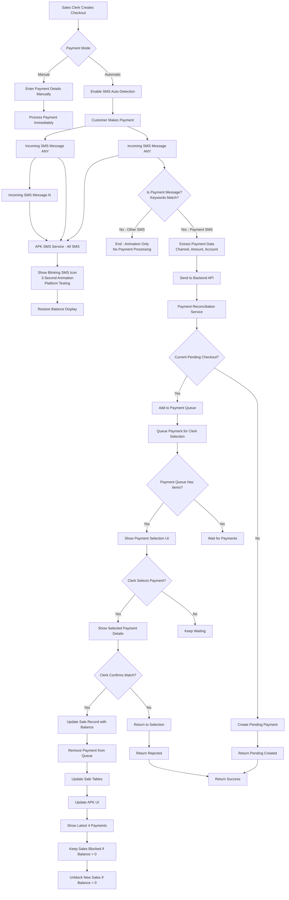
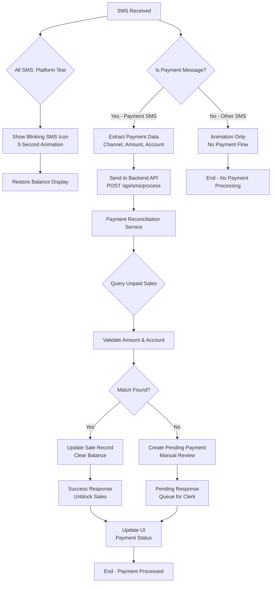
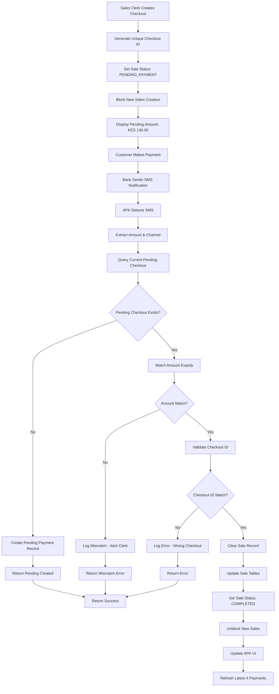
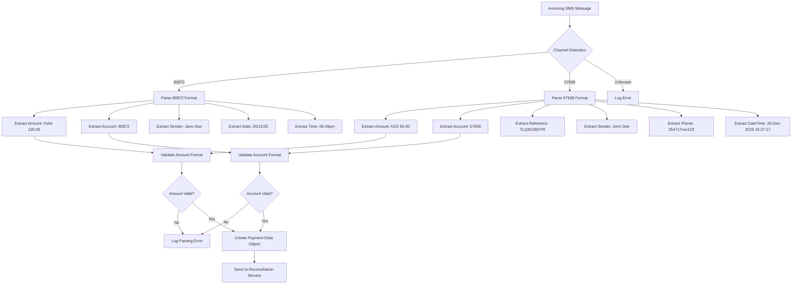
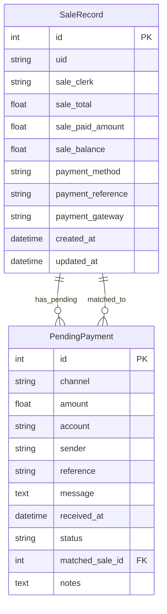
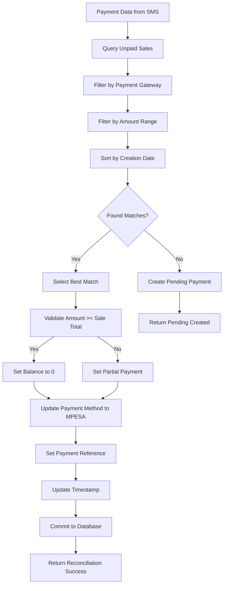

# SMS Payment Verification and Synchronization System

## Overview

This document outlines the implementation of an SMS-based payment verification and reconciliation system for the BluPOS backend. The system will automatically detect incoming SMS payment notifications, parse them according to predefined channel patterns, and reconcile them with the existing sales checkout flow.

## SMS Message Processing Logic

### Platform Infrastructure Testing
The system implements a **dual-path SMS processing approach** for comprehensive platform testing:

#### Path 1: Visual Feedback (All SMS Messages)
- **Trigger**: Any incoming SMS message
- **Action**: Blink SMS icon at center of yellow card for 3 seconds
- **Purpose**: Platform infrastructure testing and user feedback
- **UI Impact**: Temporarily replaces balance display with animated SMS icon

#### Path 2: Payment Processing (Payment SMS Only)
- **Trigger**: SMS messages matching payment patterns
- **Action**: Full payment reconciliation workflow
- **Purpose**: Financial transaction processing
- **UI Impact**: Payment queue management, clerk confirmation, sale record updates

### Message Classification Logic
```
Incoming SMS → [Platform Test: Animation] → [Payment Check: Keywords Match?]
                              ↓                           ↓
                       ✅ Always Animate            ❌ No Payment Flow
                              ↓                           ↓
                       3-Second Blink             ❓ Payment Keywords?
                              ↓                           ↓
                       Balance Restored           ✅ Yes → Payment Flow
                                                     ↓
                                               Sale Reconciliation
```

**Payment Detection Keywords**: "confirmed", "received", "payment", "M-PESA", "sent", "transaction"

## Current Payment Infrastructure Analysis

### Backend Payment Schema

The current `SaleRecord` model in `backend.py` includes:

```python
class SaleRecord(db.Model):
    id = db.Column(db.Integer, primary_key=True)
    sale_balance = db.Column(db.Float, nullable=False)
    payment_method = db.Column(db.String(20))  # 'CASH' or 'MPESA'
    payment_reference = db.Column(db.String(20))  # MPESA transaction reference
    payment_gateway = db.Column(db.Enum('223111-476921', '400200-6354', '765244-80872', '0000-0000'))
    created_at = db.Column(db.DateTime, default=datetime.now())
```

### Payment Channels Configuration

Currently supported payment channels:
- **SMS Channel 80872** - Jaystar Investments Ltd (NEW)
- **SMS Channel 57938** - Merchant Account (NEW)
- `223111-476921` - Gateway 1 (Existing)
- `400200-6354` - Gateway 2 (Existing)  
- `765244-80872` - Gateway 3 (Existing)
- `0000-0000` - Cash payments (Existing)

**Total: 6 payment channels (4 existing + 2 new SMS channels)**

### Frontend Payment Flow

The sales management system (`templates/sales_management.html`) supports:
- Manual payment entry with gateway selection
- Automatic payment reconciliation after SMS detection
- Real-time payment status updates

## SMS Message Format Specifications

### Channel 80872 Format
```
Payment Of Kshs 130.00 Has Been Received By Jaystar Investments Ltd For Account 80872, From Jane Doe on 26/12/25 at 06.49pm
```

**Pattern Analysis:**
- Amount: `Kshs 130.00`
- Account: `80872`
- Sender: `Jane Doe`
- Date: `26/12/25`
- Time: `06.49pm`

### Channel 57938 Format
```
Dear Jeffithah, Your merchant account 57938 has been credited with KES 50.00 ref #TLQ4G2B2YR from John Doe 254717xxx123 on 26-Dec-2025 15:27:17.
```

**Pattern Analysis:**
- Account: `57938`
- Amount: `KES 50.00`
- Reference: `TLQ4G2B2YR`
- Sender: `John Doe`
- Phone: `254717xxx123`
- Date/Time: `26-Dec-2025 15:27:17`

## Implementation Architecture

### Updated System Overview Flowchart (Dual-Path SMS Logic)



### Updated SMS Processing Flowchart (Dual-Path Logic)



### 1. SMS Processing Service

#### Location: `backend.py`

Add new endpoints and services for SMS processing:

```python
# New SMS processing endpoints
@app.route('/api/sms/process', methods=['POST'])
def process_incoming_sms():
    """Process incoming SMS payment notification"""
    pass

@app.route('/api/sms/reconcile', methods=['POST'])
def reconcile_sms_payment():
    """Reconcile SMS payment with existing sales record"""
    pass

@app.route('/api/sms/status', methods=['GET'])
def get_sms_status():
    """Get SMS processing status and statistics"""
    pass
```

#### SMS Parser Service

```python
class SMSPaymentParser:
    """Parse SMS messages and extract payment information"""
    
    def __init__(self):
        self.channel_patterns = {
            '80872': {
                'amount_pattern': r'Kshs\s*(\d+\.?\d*)',
                'account_pattern': r'Account\s*(\d+)',
                'sender_pattern': r'From\s*([A-Za-z\s]+)\s+on',
                'date_pattern': r'on\s*(\d{2}/\d{2}/\d{2})',
                'time_pattern': r'at\s*(\d{2}\.\d{2}(?:am|pm))'
            },
            '57938': {
                'amount_pattern': r'KES\s*(\d+\.?\d*)',
                'account_pattern': r'account\s*(\d+)',
                'ref_pattern': r'ref\s*#(\w+)',
                'sender_pattern': r'from\s*([A-Za-z\s]+)\s+\d{10}',
                'phone_pattern': r'(\d{10})',
                'datetime_pattern': r'on\s*(\d{2}-[A-Za-z]{3}-\d{4}\s+\d{2}:\d{2}:\d{2})'
            }
        }
    
    def parse_message(self, channel, message):
        """Parse SMS message and return payment data"""
        if channel not in self.channel_patterns:
            raise ValueError(f"Unknown channel: {channel}")
        
        pattern = self.channel_patterns[channel]
        result = {'channel': channel, 'message': message}
        
        # Extract amount
        amount_match = re.search(pattern['amount_pattern'], message)
        if amount_match:
            result['amount'] = float(amount_match.group(1))
        
        # Extract account
        account_match = re.search(pattern['account_pattern'], message)
        if account_match:
            result['account'] = account_match.group(1)
        
        # Extract sender
        sender_match = re.search(pattern['sender_pattern'], message)
        if sender_match:
            result['sender'] = sender_match.group(1).strip()
        
        # Extract reference (if available)
        if 'ref_pattern' in pattern:
            ref_match = re.search(pattern['ref_pattern'], message)
            if ref_match:
                result['reference'] = ref_match.group(1)
        
        # Extract date/time
        if 'datetime_pattern' in pattern:
            datetime_match = re.search(pattern['datetime_pattern'], message)
            if datetime_match:
                result['datetime'] = datetime_match.group(1)
        else:
            # Handle separate date and time patterns
            date_match = re.search(pattern['date_pattern'], message)
            time_match = re.search(pattern['time_pattern'], message)
            if date_match and time_match:
                result['datetime'] = f"{date_match.group(1)} {time_match.group(1)}"
        
        return result
```

### 2. Payment Reconciliation Service

#### Blocking Checkout Structure

The system implements a queue-based blocking structure where:

1. **Sales Clerk Creates Checkout**: Generates unique checkout ID and blocks new sales
2. **Pending Payment State**: System waits for exact amount match
3. **SMS Payment Detection**: APK detects incoming payment SMS
4. **Amount & Checkout ID Matching**: Validates exact match against pending checkout
5. **Sale Clearance**: Updates sale tables and unblocks new sales
6. **UI Update**: Refreshes latest 4 payments listing

### Blocking Checkout Flowchart



### SMS Parsing Logic Flowchart



### Database Schema Relationship Diagram



### Reconciliation Matching Logic Flowchart



#### Enhanced Reconciliation Service with Payment Queue System

```python
class PaymentReconciliationService:
    """Handle SMS payment reconciliation with blocking checkout structure and payment queue"""
    
    def __init__(self):
        self.parser = SMSPaymentParser()
        self.payment_queue = []  # In-memory queue for pending payments
    
    def process_sms_payment(self, channel, message):
        """Process incoming SMS with payment queue logic"""
        try:
            # Parse SMS message
            payment_data = self.parser.parse_message(channel, message)
            
            # Get current pending checkout (only one allowed at a time)
            pending_checkout = self.get_current_pending_checkout()
            
            if pending_checkout:
                # Add payment to queue for clerk selection
                payment_entry = {
                    'id': f"payment_{datetime.now().timestamp()}",
                    'payment_data': payment_data,
                    'pending_checkout': {
                        'id': pending_checkout.id,
                        'uid': pending_checkout.uid,
                        'remaining_balance': pending_checkout.sale_balance,
                        'payment_amount': payment_data.get('amount', 0),
                        'balance_after_payment': pending_checkout.sale_balance - payment_data.get('amount', 0)
                    },
                    'received_at': datetime.now(),
                    'status': 'queued'
                }
                
                self.payment_queue.append(payment_entry)
                
                return {
                    'status': 'queued',
                    'action': 'payment_queued',
                    'payment_id': payment_entry['id'],
                    'queue_length': len(self.payment_queue),
                    'message': f'Payment queued. {len(self.payment_queue)} payment(s) waiting for selection.'
                }
            else:
                # No pending checkout - create pending payment for manual review
                return self.create_pending_payment(payment_data)
                
        except Exception as e:
            return {'status': 'error', 'message': str(e)}
    
    def get_payment_queue(self):
        """Get current payment queue for clerk selection"""
        return {
            'status': 'success',
            'queue': self.payment_queue,
            'queue_length': len(self.payment_queue)
        }
    
    def select_payment_for_reconciliation(self, payment_id):
        """Select payment from queue for reconciliation"""
        try:
            # Find payment in queue
            selected_payment = None
            for payment in self.payment_queue:
                if payment['id'] == payment_id:
                    selected_payment = payment
                    break
            
            if not selected_payment:
                return {
                    'status': 'error',
                    'message': 'Payment not found in queue'
                }
            
            # Get pending checkout
            pending_checkout = self.get_current_pending_checkout()
            if not pending_checkout:
                return {
                    'status': 'error',
                    'message': 'No pending checkout found'
                }
            
            return {
                'status': 'success',
                'action': 'show_payment_details',
                'payment_data': selected_payment['payment_data'],
                'pending_checkout': selected_payment['pending_checkout'],
                'message': 'Payment selected for reconciliation'
            }
            
        except Exception as e:
            return {'status': 'error', 'message': str(e)}
    
    def confirm_payment_match(self, payment_id, clerk_confirmation):
        """Process clerk confirmation and update sale record"""
        try:
            if not clerk_confirmation:
                # Remove payment from queue
                self.payment_queue = [p for p in self.payment_queue if p['id'] != payment_id]
                return {
                    'status': 'rejected',
                    'action': 'payment_rejected',
                    'queue_length': len(self.payment_queue),
                    'message': 'Payment rejected and removed from queue'
                }
            
            # Find payment in queue
            selected_payment = None
            for payment in self.payment_queue:
                if payment['id'] == payment_id:
                    selected_payment = payment
                    break
            
            if not selected_payment:
                return {
                    'status': 'error',
                    'message': 'Payment not found in queue'
                }
            
            # Get pending checkout
            pending_checkout = self.get_current_pending_checkout()
            if not pending_checkout:
                return {
                    'status': 'error',
                    'message': 'No pending checkout found'
                }
            
            payment_amount = selected_payment['payment_data'].get('amount', 0)
            remaining_balance = pending_checkout.sale_balance
            
            # Update payment method and reference
            pending_checkout.payment_method = 'MPESA'
            pending_checkout.payment_reference = selected_payment['payment_data'].get('reference', '')
            pending_checkout.payment_gateway = selected_payment['payment_data'].get('account', '')
            
            # Calculate new balance
            new_balance = remaining_balance - payment_amount
            
            # Update sale record
            pending_checkout.sale_paid_amount += payment_amount
            pending_checkout.sale_balance = max(0, new_balance)  # Ensure balance doesn't go negative
            
            # Update timestamp
            pending_checkout.updated_at = datetime.now()
            
            # Remove payment from queue
            self.payment_queue = [p for p in self.payment_queue if p['id'] != payment_id]
            
            # Determine if sale is completed
            if pending_checkout.sale_balance <= 0:
                pending_checkout.sale_balance = 0
                pending_checkout.checkout_status = 'COMPLETED'
                unblock_sales = True
            else:
                pending_checkout.checkout_status = 'PENDING_PAYMENT'
                unblock_sales = False
            
            db.session.commit()
            
            return {
                'status': 'success',
                'action': 'payment_confirmed',
                'sale_id': pending_checkout.id,
                'sale_uid': pending_checkout.uid,
                'amount_reconciled': payment_amount,
                'remaining_balance': pending_checkout.sale_balance,
                'unblock_sales': unblock_sales,
                'queue_length': len(self.payment_queue),
                'message': f'Payment confirmed. Remaining balance: KES {pending_checkout.sale_balance}'
            }
            
        except Exception as e:
            return {'status': 'error', 'message': str(e)}
    
    def get_current_pending_checkout(self):
        """Get the current pending checkout (only one allowed at a time)"""
        # Find sales with pending payment status (blocking state)
        return SaleRecord.query.filter(
            SaleRecord.sale_balance > 0,
            SaleRecord.payment_method.is_(None),  # No payment method set yet
            SaleRecord.payment_reference.is_(None)  # No reference set yet
        ).order_by(SaleRecord.created_at.desc()).first()
    
    def create_pending_payment(self, payment_data):
        """Create pending payment record for unmatched SMS"""
        pending_payment = PendingPayment(
            channel=payment_data['channel'],
            amount=payment_data.get('amount', 0),
            account=payment_data.get('account', ''),
            sender=payment_data.get('sender', ''),
            reference=payment_data.get('reference', ''),
            message=payment_data['message'],
            received_at=datetime.now(),
            status='pending'
        )
        
        db.session.add(pending_payment)
        db.session.commit()
        
        return {
            'status': 'pending',
            'action': 'created_pending',
            'pending_id': pending_payment.id,
            'message': 'No pending checkout found, created pending payment for review'
        }
```

#### Enhanced Payment Queue UI with Clerk Selection

```javascript
// Show payment queue for clerk selection
function showPaymentQueue() {
    const queueData = getPaymentQueue();
    
    if (queueData.queue_length === 0) {
        flash_message('No payments in queue');
        return;
    }
    
    const modal = document.createElement('div');
    modal.className = 'payment-queue-modal';
    modal.innerHTML = `
        <div class="modal-content">
            <h3>Payment Selection</h3>
            <p>Current Queue: ${queueData.queue_length} payment(s)</p>
            <div class="payment-queue-list">
                ${queueData.queue.map((payment, index) => `
                    <div class="payment-queue-item" onclick="selectPayment('${payment.id}')">
                        <div class="payment-info">
                            <span class="payment-amount">KES ${payment.payment_data.amount.toFixed(2)}</span>
                            <span class="payment-sender">${payment.payment_data.sender}</span>
                            <span class="payment-time">${payment.payment_data.datetime}</span>
                        </div>
                        <div class="payment-balance">
                            <span class="balance-text">Balance: KES ${payment.pending_checkout.remaining_balance.toFixed(2)}</span>
                            <span class="arrow">→</span>
                            <span class="new-balance">New: KES ${Math.max(0, payment.pending_checkout.balance_after_payment).toFixed(2)}</span>
                        </div>
                        <div class="payment-select-btn">
                            <button class="btn-select" onclick="event.stopPropagation(); selectPayment('${payment.id}')">
                                Select
                            </button>
                        </div>
                    </div>
                `).join('')}
            </div>
            <div class="modal-actions">
                <button class="btn-close" onclick="closePaymentQueue()">
                    Close
                </button>
            </div>
        </div>
    `;
    
    document.body.appendChild(modal);
}

// Select payment for reconciliation
function selectPayment(paymentId) {
    fetch('/api/sms/select-payment', {
        method: 'POST',
        headers: {'Content-Type': 'application/json'},
        body: JSON.stringify({
            payment_id: paymentId
        })
    })
    .then(response => response.json())
    .then(data => {
        if (data.status === 'success') {
            closePaymentQueue();
            showSelectedPaymentDetails(data.payment_data, data.pending_checkout);
        }
    });
}

// Show selected payment details for confirmation
function showSelectedPaymentDetails(paymentData, pendingCheckout) {
    const modal = document.createElement('div');
    modal.className = 'confirmation-modal';
    
    const paymentAmount = paymentData.amount;
    const remainingBalance = pendingCheckout.remaining_balance;
    const balanceAfterPayment = pendingCheckout.balance_after_payment;
    
    // Determine message based on payment amount
    let balanceMessage = '';
    if (paymentAmount > remainingBalance) {
        balanceMessage = `<p style="color: green; font-weight: bold;">✅ Payment exceeds balance by: KES ${Math.abs(balanceAfterPayment).toFixed(2)}</p>`;
    } else if (paymentAmount < remainingBalance) {
        balanceMessage = `<p style="color: orange; font-weight: bold;">⚠️ Payment is less by: KES ${Math.abs(balanceAfterPayment).toFixed(2)}</p>`;
    } else {
        balanceMessage = `<p style="color: blue; font-weight: bold;">✅ Payment matches balance exactly</p>`;
    }
    
    modal.innerHTML = `
        <div class="modal-content">
            <h3>Confirm Payment Selection</h3>
            <div class="payment-details">
                <p><strong>Selected Payment:</strong> KES ${paymentAmount.toFixed(2)}</p>
                <p><strong>Account:</strong> ${paymentData.account}</p>
                <p><strong>Sender:</strong> ${paymentData.sender}</p>
                <p><strong>Time:</strong> ${paymentData.datetime}</p>
                <hr>
                <p><strong>Current Balance:</strong> KES ${remainingBalance.toFixed(2)}</p>
                ${balanceMessage}
                <p><strong>Balance After Payment:</strong> KES ${Math.max(0, balanceAfterPayment).toFixed(2)}</p>
            </div>
            <div class="modal-actions">
                <button class="btn-confirm" onclick="confirmSelectedPayment('${paymentData.id}', ${paymentAmount}, ${remainingBalance})">
                    Confirm Match
                </button>
                <button class="btn-reject" onclick="rejectSelectedPayment('${paymentData.id}')">
                    Reject Payment
                </button>
                <button class="btn-back" onclick="showPaymentQueue()">
                    Back to Queue
                </button>
            </div>
        </div>
    `;
    
    document.body.appendChild(modal);
}

// Confirm selected payment
function confirmSelectedPayment(paymentId, paymentAmount, remainingBalance) {
    fetch('/api/sms/confirm-payment', {
        method: 'POST',
        headers: {'Content-Type': 'application/json'},
        body: JSON.stringify({
            payment_id: paymentId,
            clerk_confirmation: true,
            payment_amount: paymentAmount,
            remaining_balance: remainingBalance
        })
    })
    .then(response => response.json())
    .then(data => {
        if (data.status === 'success') {
            const message = data.unblock_sales 
                ? 'Payment confirmed and reconciled. New sales unblocked.'
                : `Payment confirmed. Remaining balance: KES ${data.remaining_balance}. Queue length: ${data.queue_length}`;
            
            flash_message(message);
            updateSalesRecords();
            updateLatestPayments();
            closeConfirmationDialog();
            
            // Update sales blocking status
            if (data.unblock_sales) {
                unblockNewSales();
            } else {
                updatePendingBalanceDisplay(data.remaining_balance);
            }
            
            // Refresh queue if there are more payments
            if (data.queue_length > 0) {
                setTimeout(() => {
                    showPaymentQueue();
                }, 2000);
            }
        }
    });
}

// Reject selected payment
function rejectSelectedPayment(paymentId) {
    fetch('/api/sms/confirm-payment', {
        method: 'POST',
        headers: {'Content-Type': 'application/json'},
        body: JSON.stringify({
            payment_id: paymentId,
            clerk_confirmation: false
        })
    })
    .then(response => response.json())
    .then(data => {
        flash_message(`Payment rejected. Queue length: ${data.queue_length}`);
        closeConfirmationDialog();
        
        // Refresh queue
        if (data.queue_length > 0) {
            setTimeout(() => {
                showPaymentQueue();
            }, 1000);
        }
    });
}

// Close payment queue modal
function closePaymentQueue() {
    const modal = document.querySelector('.payment-queue-modal');
    if (modal) {
        modal.remove();
    }
}

// Get payment queue from backend
function getPaymentQueue() {
    // This would typically be fetched from backend
    // For now, return mock data structure
    return {
        status: 'success',
        queue: [],
        queue_length: 0
    };
}
```

#### Enhanced Clerk Confirmation Dialog with Balance Information

```javascript
// Show clerk confirmation dialog for automatic payments with balance details
function showClerkConfirmationDialog(paymentData, pendingCheckout) {
    const modal = document.createElement('div');
    modal.className = 'confirmation-modal';
    
    const paymentAmount = paymentData.amount;
    const remainingBalance = pendingCheckout.remaining_balance;
    const balanceAfterPayment = pendingCheckout.balance_after_payment;
    
    // Determine message based on payment amount
    let balanceMessage = '';
    if (paymentAmount > remainingBalance) {
        balanceMessage = `<p style="color: green; font-weight: bold;">✅ Payment exceeds balance by: KES ${Math.abs(balanceAfterPayment).toFixed(2)}</p>`;
    } else if (paymentAmount < remainingBalance) {
        balanceMessage = `<p style="color: orange; font-weight: bold;">⚠️ Payment is less by: KES ${Math.abs(balanceAfterPayment).toFixed(2)}</p>`;
    } else {
        balanceMessage = `<p style="color: blue; font-weight: bold;">✅ Payment matches balance exactly</p>`;
    }
    
    modal.innerHTML = `
        <div class="modal-content">
            <h3>Payment Confirmation Required</h3>
            <div class="payment-details">
                <p><strong>Amount:</strong> KES ${paymentAmount.toFixed(2)}</p>
                <p><strong>Account:</strong> ${paymentData.account}</p>
                <p><strong>Sender:</strong> ${paymentData.sender}</p>
                <p><strong>Time:</strong> ${paymentData.datetime}</p>
                <hr>
                <p><strong>Current Balance:</strong> KES ${remainingBalance.toFixed(2)}</p>
                ${balanceMessage}
                <p><strong>Balance After Payment:</strong> KES ${Math.max(0, balanceAfterPayment).toFixed(2)}</p>
            </div>
            <div class="modal-actions">
                <button class="btn-confirm" onclick="confirmPaymentWithBalance('${paymentData.id}', ${paymentAmount}, ${remainingBalance})">
                    Confirm Match
                </button>
                <button class="btn-reject" onclick="rejectPayment('${paymentData.id}')">
                    Reject
                </button>
            </div>
        </div>
    `;
    
    document.body.appendChild(modal);
}

// Confirm payment match with balance calculation
function confirmPaymentWithBalance(paymentId, paymentAmount, remainingBalance) {
    // Send confirmation to backend with balance information
    fetch('/api/sms/confirm-payment', {
        method: 'POST',
        headers: {'Content-Type': 'application/json'},
        body: JSON.stringify({
            payment_id: paymentId,
            clerk_confirmation: true,
            payment_amount: paymentAmount,
            remaining_balance: remainingBalance
        })
    })
    .then(response => response.json())
    .then(data => {
        if (data.status === 'success') {
            const message = data.unblock_sales 
                ? 'Payment confirmed and reconciled. New sales unblocked.'
                : `Payment confirmed. Remaining balance: KES ${data.remaining_balance}. Sales still blocked.`;
            
            flash_message(message);
            updateSalesRecords();
            updateLatestPayments();
            closeConfirmationDialog();
            
            // Update sales blocking status
            if (data.unblock_sales) {
                unblockNewSales();
            } else {
                updatePendingBalanceDisplay(data.remaining_balance);
            }
        }
    });
}

// Update pending balance display
function updatePendingBalanceDisplay(remainingBalance) {
    const balanceDisplay = document.getElementById('pending-balance-display');
    if (balanceDisplay) {
        balanceDisplay.innerHTML = `Remaining Balance: KES ${remainingBalance.toFixed(2)}`;
        balanceDisplay.style.display = 'block';
    }
}

// Unblock new sales
function unblockNewSales() {
    // Enable sales creation interface
    const checkoutSection = document.getElementById('checkout_section');
    if (checkoutSection) {
        checkoutSection.style.display = 'none';
    }
    
    const saleContainer = document.getElementById('sale_container');
    if (saleContainer) {
        saleContainer.style.display = 'block';
    }
    
    // Reset payment mode to manual
    setPaymentMode('manual');
}
```

#### Enhanced Database Schema with Blocking Status

```python
class SaleRecord(db.Model):
    id = db.Column(db.Integer, primary_key=True)
    uid = db.Column(db.String(50), unique=True, nullable=False)
    sale_clerk = db.Column(db.String(100), nullable=False)
    sale_total = db.Column(db.Float, nullable=False)
    sale_paid_amount = db.Column(db.Float, nullable=False)
    sale_balance = db.Column(db.Float, nullable=False)
    payment_method = db.Column(db.String(20))  # 'CASH', 'MPESA', or None (pending)
    payment_reference = db.Column(db.String(20))  # MPESA transaction reference or None (pending)
    payment_gateway = db.Column(db.Enum('223111-476921', '400200-6354', '765244-80872', '0000-0000'))
    created_at = db.Column(db.DateTime, default=datetime.now())
    updated_at = db.Column(db.DateTime, default=datetime.now())
    
    # New fields for blocking checkout
    checkout_id = db.Column(db.String(50), unique=True)  # Generated for pending checkouts
    checkout_status = db.Column(db.Enum('PENDING_PAYMENT', 'COMPLETED', 'CANCELLED'), default='PENDING_PAYMENT')
    
    def __repr__(self):
        return f"SaleRecord(id={self.id}, uid='{self.uid}', checkout_id='{self.checkout_id}', status='{self.checkout_status}')"
```

### 3. Database Schema Extensions

#### Pending Payment Model

```python
class PendingPayment(db.Model):
    """Store unmatched SMS payments for manual review"""
    id = db.Column(db.Integer, primary_key=True)
    channel = db.Column(db.String(20), nullable=False)
    amount = db.Column(db.Float, nullable=False)
    account = db.Column(db.String(20), nullable=False)
    sender = db.Column(db.String(100))
    reference = db.Column(db.String(50))
    message = db.Column(db.Text, nullable=False)
    received_at = db.Column(db.DateTime, default=datetime.now())
    status = db.Column(db.Enum('pending', 'matched', 'ignored'), default='pending')
    matched_sale_id = db.Column(db.Integer, db.ForeignKey('sale_record.id'))
    notes = db.Column(db.Text)
```

### 4. APK Integration

#### Enhanced SMS Service with Clerk Confirmation

Location: `apk_section/blupos_wallet/lib/services/sms_service.dart`

```dart
class EnhancedSmsService extends ChangeNotifier {
  final PaymentReconciliationService _reconciliationService = PaymentReconciliationService();
  bool _isAutoModeEnabled = false;
  
  // Listen for incoming SMS and process payments
  void startSmsListener() {
    // Use platform channels to access SMS inbox
    // Parse incoming messages for payment notifications
    // Send to backend for reconciliation
  }
  
  Future<void> processSmsMessage(String message, String sender) async {
    try {
      // Check if message matches payment format
      if (_isPaymentMessage(message)) {
        // Extract channel from sender or message content
        final channel = _extractChannel(message, sender);
        
        // Send to backend for processing
        final response = await ApiClient.processSmsPayment(channel, message);
        
        if (response['status'] == 'success') {
          // Update UI with reconciliation status
          _showReconciliationNotification(response);
        } else if (response['status'] == 'pending' && _isAutoModeEnabled) {
          // Show clerk confirmation dialog for automatic mode
          _showClerkConfirmationDialog(response);
        }
      }
    } catch (e) {
      print('Error processing SMS: $e');
    }
  }
  
  void enableAutoMode() {
    _isAutoModeEnabled = true;
    notifyListeners();
  }
  
  void disableAutoMode() {
    _isAutoModeEnabled = false;
    notifyListeners();
  }
  
  bool _isPaymentMessage(String message) {
    // Check if message contains payment keywords
    final paymentKeywords = ['Payment Of', 'credited with', 'Kshs', 'KES'];
    return paymentKeywords.any((keyword) => message.contains(keyword));
  }
  
  void _showClerkConfirmationDialog(Map<String, dynamic> paymentData) {
    // Show dialog to clerk with payment details
    // Clerk must confirm before reconciliation proceeds
    // This ensures manual approval in automatic mode
  }
  
  void _showReconciliationNotification(Map<String, dynamic> response) {
    // Update UI with reconciliation status
    // Refresh latest 4 payments list
    // Show success/error messages
  }
}
```

#### Sales Page Payment Mode Selection

Location: `templates/sales_management.html`

```javascript
// Add payment mode selection to sales interface
function addPaymentModeSelection() {
    const paymentModeContainer = document.createElement('div');
    paymentModeContainer.className = 'payment-mode-container';
    paymentModeContainer.innerHTML = `
        <div class="payment-mode-selector">
            <label>Payment Mode:</label>
            <div class="mode-buttons">
                <button id="manual-mode-btn" class="mode-btn active" onclick="setPaymentMode('manual')">
                    Manual
                </button>
                <button id="auto-mode-btn" class="mode-btn" onclick="setPaymentMode('automatic')">
                    Automatic
                </button>
            </div>
        </div>
    `;
    
    // Insert before checkout section
    const checkoutSection = document.getElementById('checkout_section');
    checkoutSection.parentNode.insertBefore(paymentModeContainer, checkoutSection);
}

// Set payment mode and update UI
function setPaymentMode(mode) {
    // Update button states
    const manualBtn = document.getElementById('manual-mode-btn');
    const autoBtn = document.getElementById('auto-mode-btn');
    
    if (mode === 'manual') {
        manualBtn.classList.add('active');
        autoBtn.classList.remove('active');
        // Enable manual payment fields
        document.getElementById('payment_method').disabled = false;
        document.getElementById('mpesa_gateway').disabled = false;
        // Disable auto mode features
        disableAutoModeFeatures();
    } else {
        autoBtn.classList.add('active');
        manualBtn.classList.remove('active');
        // Disable manual payment fields
        document.getElementById('payment_method').disabled = true;
        document.getElementById('mpesa_gateway').disabled = true;
        // Enable auto mode features
        enableAutoModeFeatures();
    }
}

// Enable automatic mode features
function enableAutoModeFeatures() {
    // Enable SMS auto-detection
    // Show pending payment status
    // Enable clerk confirmation dialogs
    console.log('Auto mode enabled - waiting for SMS payment...');
}

// Disable automatic mode features
function disableAutoModeFeatures() {
    // Disable SMS auto-detection
    // Hide pending payment status
    // Disable clerk confirmation dialogs
    console.log('Auto mode disabled - manual payment required');
}

// Show clerk confirmation dialog for automatic payments
function showClerkConfirmationDialog(paymentData) {
    const modal = document.createElement('div');
    modal.className = 'confirmation-modal';
    modal.innerHTML = `
        <div class="modal-content">
            <h3>Payment Confirmation Required</h3>
            <div class="payment-details">
                <p><strong>Amount:</strong> KES ${paymentData.amount}</p>
                <p><strong>Account:</strong> ${paymentData.account}</p>
                <p><strong>Sender:</strong> ${paymentData.sender}</p>
                <p><strong>Time:</strong> ${paymentData.datetime}</p>
            </div>
            <div class="modal-actions">
                <button class="btn-confirm" onclick="confirmPayment('${paymentData.id}')">
                    Confirm Match
                </button>
                <button class="btn-reject" onclick="rejectPayment('${paymentData.id}')">
                    Reject
                </button>
            </div>
        </div>
    `;
    
    document.body.appendChild(modal);
}

// Confirm payment match
function confirmPayment(paymentId) {
    // Send confirmation to backend
    fetch('/api/sms/confirm-payment', {
        method: 'POST',
        headers: {'Content-Type': 'application/json'},
        body: JSON.stringify({
            payment_id: paymentId,
            clerk_confirmation: true
        })
    })
    .then(response => response.json())
    .then(data => {
        if (data.status === 'success') {
            flash_message('Payment confirmed and reconciled');
            updateSalesRecords();
            updateLatestPayments();
            closeConfirmationDialog();
        }
    });
}

// Reject payment match
function rejectPayment(paymentId) {
    // Send rejection to backend
    fetch('/api/sms/reject-payment', {
        method: 'POST',
        headers: {'Content-Type': 'application/json'},
        body: JSON.stringify({
            payment_id: paymentId,
            clerk_confirmation: false
        })
    })
    .then(response => response.json())
    .then(data => {
        flash_message('Payment rejected - manual review required');
        closeConfirmationDialog();
    });
}

// Update latest 4 payments display
function updateLatestPayments() {
    fetch('/get_latest_payments')
    .then(response => response.json())
    .then(data => {
        if (data.status === 'success') {
            const paymentList = document.getElementById('payment-list');
            paymentList.innerHTML = '';
            
            data.payments.forEach(payment => {
                const paymentItem = document.createElement('div');
                paymentItem.className = 'payment-item';
                paymentItem.innerHTML = `
                    <span class="payment-amount">KES ${payment.amount}</span>
                    <span class="payment-time">${payment.datetime}</span>
                    <span class="payment-clerk">${payment.sales_person}</span>
                `;
                paymentList.appendChild(paymentItem);
            });
        }
    });
}
```

### 5. Frontend Integration

#### Sales Management Updates

Location: `templates/sales_management.html`

```javascript
// Add SMS reconciliation status to sales interface
function updateSmsReconciliationStatus() {
    // Poll backend for new SMS reconciliations
    // Update sales records with reconciliation status
    // Show notifications for successful reconciliations
}

// Add SMS reconciliation button to sales checkout
function addSmsReconciliationButton() {
    const reconciliationBtn = document.createElement('button');
    reconciliationBtn.innerHTML = 'Reconcile SMS Payment';
    reconciliationBtn.onclick = triggerSmsReconciliation;
    document.getElementById('checkout_button_container').appendChild(reconciliationBtn);
}

function triggerSmsReconciliation() {
    // Trigger manual SMS reconciliation check
    fetch('/api/sms/reconcile', {
        method: 'POST',
        headers: {'Content-Type': 'application/json'},
        body: JSON.stringify({
            channel: document.getElementById('mpesa_gateway').value,
            manual_check: true
        })
    })
    .then(response => response.json())
    .then(data => {
        if (data.status === 'success') {
            flash_message('SMS reconciliation completed');
            updateSalesRecords();
        }
    });
}
```

## Implementation Steps

### Phase 1: Backend Infrastructure
1. [ ] Add SMS parser service to `backend.py`
2. [ ] Create payment reconciliation service
3. [ ] Add database model for pending payments
4. [ ] Implement API endpoints for SMS processing
5. [ ] Add logging and error handling

### Phase 2: APK Integration
1. [ ] Enhance SMS service with payment detection
2. [ ] Add platform channels for SMS access
3. [ ] Implement real-time SMS processing
4. [ ] Add reconciliation status notifications
5. [ ] Update UI for SMS reconciliation

### Phase 3: Frontend Integration
1. [ ] Update sales management interface
2. [ ] Add SMS reconciliation controls
3. [ ] Implement real-time status updates
4. [ ] Add manual reconciliation features
5. [ ] Update payment flow documentation

### Phase 4: Testing and Deployment
1. [ ] Create test SMS messages for both channels
2. [ ] Test reconciliation accuracy
3. [ ] Performance testing with high SMS volume
4. [ ] Security testing for SMS spoofing
5. [ ] Deploy to production environment

## Security Considerations

### SMS Spoofing Protection
- Validate sender phone numbers against known payment providers
- Implement message signature verification where possible
- Add rate limiting for SMS processing
- Log all SMS processing attempts for audit

### Data Validation
- Validate all extracted payment data
- Check for reasonable amount ranges
- Verify account numbers against configured gateways
- Implement duplicate payment detection

### Error Handling
- Graceful handling of malformed SMS messages
- Fallback to manual reconciliation for unmatched payments
- Clear error messages for failed reconciliations
- Comprehensive logging for troubleshooting

## Monitoring and Maintenance

### Key Metrics to Monitor
- SMS processing success rate
- Reconciliation accuracy
- Pending payment volume
- System response time
- Error rates and types

### Maintenance Tasks
- Regular review of pending payments
- Update SMS parsing patterns as needed
- Monitor for new payment channel formats
- Performance optimization based on usage patterns
- Security audit of SMS processing pipeline

## Future Enhancements

### Additional Payment Channels
- Support for more payment providers
- Dynamic channel configuration
- Channel-specific parsing rules

### Advanced Features
- SMS payment scheduling
- Bulk reconciliation for multiple payments
- Integration with accounting systems
- Advanced fraud detection

### Mobile App Features
- SMS payment history
- Reconciliation reports
- Manual payment entry
- Payment status tracking

## Conclusion

This SMS payment verification and synchronization system provides a robust solution for automatically reconciling SMS payment notifications with the existing BluPOS sales checkout flow. The implementation includes comprehensive parsing, reconciliation, and integration capabilities while maintaining security and reliability standards.

The system supports both automated and manual reconciliation workflows, ensuring that all payments are properly tracked and accounted for in the sales management system.
