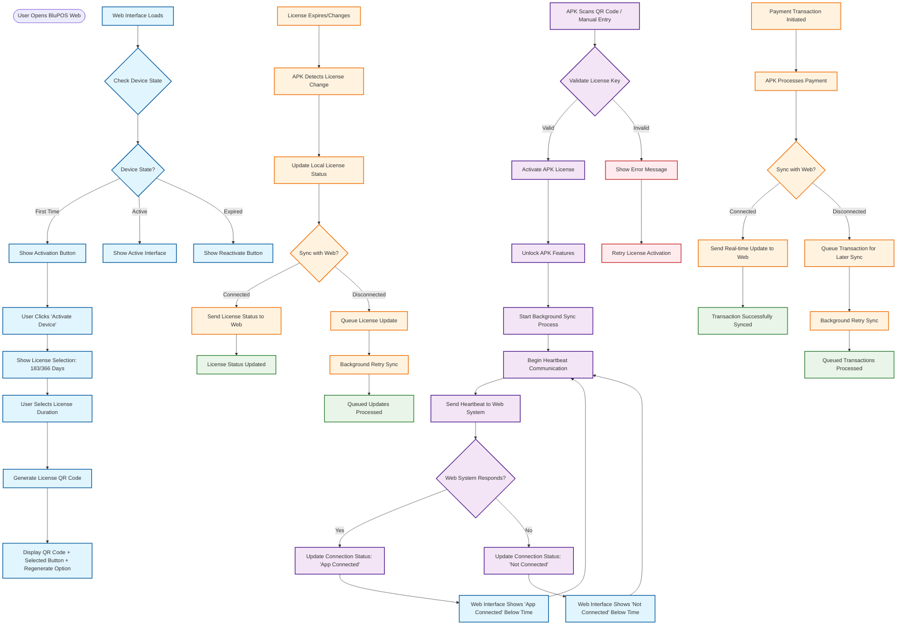

# BluPOS APK-Web Synchronization System

## Overview

This document outlines the synchronization and communication system between the BluPOS web application and the BluPOS mobile APK. The system enables seamless license activation, real-time connectivity monitoring, and background communication between the web POS system and mobile payment processing.

## Key Features

### 1. License Activation Flow
- **Input Methods**: Manual license key entry or QR code scanning
- **Validation**: Real-time license validation against web system
- **Activation**: Automatic APK unlocking upon successful validation
- **Persistence**: License status maintained across app sessions

### 2. Real-Time Connectivity Monitoring
- **Background Process**: Continuous connectivity checking
- **Status Display**: Visual indicators in web interface
- **Automatic Updates**: Real-time connection status updates
- **Offline Handling**: Graceful degradation when connection lost

### 3. Background Communication
- **Heartbeat Mechanism**: Regular connectivity pings
- **Status Synchronization**: License and payment status updates
- **Error Recovery**: Automatic reconnection on network issues

## System Architecture

```
┌─────────────────┐    HTTP/WebSocket    ┌─────────────────┐
│   BluPOS Web    │◄──────────────────►│   BluPOS APK    │
│   Application   │                     │   Mobile App    │
│                 │                     │                 │
│ • License Mgmt  │                     │ • License Scan  │
│ • Status Display│                     │ • Payment Proc  │
│ • Real-time UI  │                     │ • Background Sync│
└─────────────────┘                     └─────────────────┘
```

## Detailed Flowchart

### License Activation & Synchronization Flow



## Component Details

### Web System Components

#### 1. License Management Interface
- **Location**: `templates/user_management.html`
- **Features**:
  - License duration selection (183/366 days)
  - QR code generation and display
  - License regeneration capability
  - Real-time connection status display

#### 2. Connection Status Display
- **Location**: Below system time in activation interface
- **States**:
  - 🟢 **App Connected**: Green indicator when APK is online
  - 🔴 **Not Connected**: Red indicator when APK is offline
  - 🟡 **Connecting**: Yellow indicator during connection attempts

#### 3. Real-time Updates
- **Polling Interval**: Every 2 seconds
- **Data Sources**:
  - License status from database
  - Connection status from background service
  - Payment data synchronization

### APK Components

#### 1. License Activation Module
- **Input Methods**:
  - QR code scanning using device camera
  - Manual license key entry
  - NFC/Bluetooth license transfer (future)

#### 2. Background Synchronization Service
- **Service Name**: `BluPosSyncService`
- **Responsibilities**:
  - Maintain persistent connection to web system
  - Send heartbeat signals every 30 seconds
  - Queue transactions during offline periods
  - Sync license status changes

#### 3. Connection Management
- **Reconnection Logic**:
  - Exponential backoff (30s, 1m, 2m, 5m, 10m max)
  - Network change detection
  - Automatic reconnection on app resume

## API Endpoints

### Web System Endpoints

#### License Management
```http
POST /generate_license_qr
Content-Type: application/json

{
  "license_days": 183 | 366,
  "device_id": "string"
}

Response:
{
  "status": "success",
  "license_type": "BLUXXXX" | "POSXXXX",
  "license_key": "BLUXXXX",
  "qr_code": "data:image/png;base64,...",
  "device_id": "device_1234567890"
}
```

#### Connection Status
```http
GET /apk_connection_status

Response:
{
  "status": "success",
  "connected": true | false,
  "last_seen": "2025-12-27T12:23:58Z",
  "device_id": "device_1234567890"
}
```

### APK Endpoints

#### License Validation
```http
POST /validate_license
Content-Type: application/json

{
  "license_key": "BLUXXXX",
  "device_id": "device_1234567890",
  "device_info": {
    "model": "Samsung Galaxy S21",
    "os_version": "Android 12",
    "app_version": "1.0.0"
  }
}

Response:
{
  "status": "success",
  "license_type": "BLUXXXX",
  "valid_until": "2026-06-28T00:00:00Z",
  "features": ["payments", "reports", "sync"]
}
```

#### Heartbeat Signal
```http
POST /heartbeat
Content-Type: application/json

{
  "device_id": "device_1234567890",
  "license_key": "BLUXXXX",
  "timestamp": "2025-12-27T12:23:58Z",
  "battery_level": 85,
  "network_type": "WIFI"
}

Response:
{
  "status": "success",
  "server_time": "2025-12-27T12:23:58Z",
  "commands": [] // Future use for remote commands
}
```

## Implementation Details

### Web Interface Updates

#### Connection Status Display
```html
<!-- In system info panel, below time display -->
<div id="connection-status" class="connection-indicator">
    <span id="connection-dot" class="status-dot"></span>
    <span id="connection-text">Checking connection...</span>
</div>
```

```css
.connection-indicator {
    display: flex;
    align-items: center;
    justify-content: center;
    margin-top: 8px;
    font-size: 12px;
    font-weight: 500;
}

.status-dot {
    width: 8px;
    height: 8px;
    border-radius: 50%;
    margin-right: 6px;
    animation: pulse 2s infinite;
}

.status-dot.connected {
    background-color: #28a745;
    animation: none;
}

.status-dot.disconnected {
    background-color: #dc3545;
    animation: none;
}

.status-dot.connecting {
    background-color: #ffc107;
}

@keyframes pulse {
    0% { opacity: 1; }
    50% { opacity: 0.5; }
    100% { opacity: 1; }
}
```

#### JavaScript Connection Monitoring
```javascript
// Background connection checking
function checkAPKConnection() {
    fetch('/apk_connection_status')
        .then(response => response.json())
        .then(data => {
            updateConnectionStatus(data.connected);
        })
        .catch(error => {
            updateConnectionStatus(false);
        });
}

// Update UI based on connection status
function updateConnectionStatus(isConnected) {
    const statusDot = document.getElementById('connection-dot');
    const statusText = document.getElementById('connection-text');

    if (isConnected) {
        statusDot.className = 'status-dot connected';
        statusText.textContent = 'App Connected';
    } else {
        statusDot.className = 'status-dot disconnected';
        statusText.textContent = 'Not Connected';
    }
}

// Start connection monitoring
setInterval(checkAPKConnection, 30000); // Check every 30 seconds
```

### APK Implementation

#### Background Service
```kotlin
// BluPosSyncService.kt
class BluPosSyncService : Service() {
    private val handler = Handler(Looper.getMainLooper())
    private val heartbeatRunnable = object : Runnable {
        override fun run() {
            sendHeartbeat()
            handler.postDelayed(this, 30000) // 30 seconds
        }
    }

    override fun onCreate() {
        super.onCreate()
        startHeartbeat()
    }

    private fun startHeartbeat() {
        handler.post(heartbeatRunnable)
    }

    private fun sendHeartbeat() {
        val heartbeatData = JSONObject().apply {
            put("device_id", deviceId)
            put("license_key", licenseKey)
            put("timestamp", System.currentTimeMillis())
            put("battery_level", getBatteryLevel())
            put("network_type", getNetworkType())
        }

        // Send heartbeat to web system
        CoroutineScope(Dispatchers.IO).launch {
            try {
                val response = apiClient.post("/heartbeat", heartbeatData.toString())
                if (response.isSuccessful) {
                    updateConnectionStatus(true)
                } else {
                    updateConnectionStatus(false)
                }
            } catch (e: Exception) {
                updateConnectionStatus(false)
            }
        }
    }
}
```

#### License Activation Flow
```kotlin
// ActivationPage.kt
suspend fun activateLicense(licenseKey: String) {
    try {
        val response = apiClient.post("/validate_license",
            JSONObject().apply {
                put("license_key", licenseKey)
                put("device_id", deviceId)
                put("device_info", getDeviceInfo())
            }.toString()
        )

        if (response.isSuccessful) {
            val licenseData = JSONObject(response.body?.string() ?: "{}")
            saveLicenseData(licenseData)
            unlockAppFeatures()
            startSyncService()
        } else {
            showError("Invalid license key")
        }
    } catch (e: Exception) {
        showError("Connection failed. Please check your internet connection.")
    }
}
```

## Security Considerations

### License Key Protection
- **Encryption**: License keys stored encrypted on device
- **Validation**: Server-side validation on each request
- **Revocation**: Ability to revoke licenses remotely

### Communication Security
- **HTTPS**: All communication over secure channels
- **Authentication**: Device-specific authentication tokens
- **Rate Limiting**: Prevent abuse of heartbeat endpoints

### Data Privacy
- **Minimal Data**: Only essential device and license information
- **No Sensitive Data**: Payment data never stored on APK
- **GDPR Compliance**: Data handling follows privacy regulations

## Testing Scenarios

### 1. License Activation
- **Test Case**: Valid license key activation
- **Expected**: APK unlocks, background sync starts
- **Verification**: Check license status in web interface

### 2. Connection Monitoring
- **Test Case**: Turn APK offline, then online
- **Expected**: Web interface shows connection status changes
- **Verification**: Status indicators update in real-time

### 3. Offline Operation
- **Test Case**: Process payments while offline
- **Expected**: Transactions queued and synced when online
- **Verification**: Check transaction logs after reconnection

### 4. License Expiration
- **Test Case**: License expires during operation
- **Expected**: APK detects change and updates status
- **Verification**: Web interface reflects license status

## Future Enhancements

### Advanced Features
- **Push Notifications**: Real-time alerts from web to APK
- **Remote Management**: Web-based APK configuration
- **Bulk Operations**: Multiple device management
- **Analytics**: Usage and performance metrics

### Performance Optimizations
- **Connection Pooling**: Efficient network resource usage
- **Data Compression**: Reduced bandwidth usage
- **Caching**: Smart data caching for offline scenarios

This synchronization system ensures seamless communication between the BluPOS web system and mobile APK, providing a unified experience for license management and payment processing.
