# Expo BLUPOS v5 - Infrastructure Documentation

## Project Overview

Expo BLUPOS v5 is a comprehensive Point of Sale (POS) system built with Flask and SQLAlchemy, designed for retail businesses to manage inventory, process sales, and handle user administration. The system features role-based access control, licensing management, and comprehensive reporting capabilities.

## System Architecture

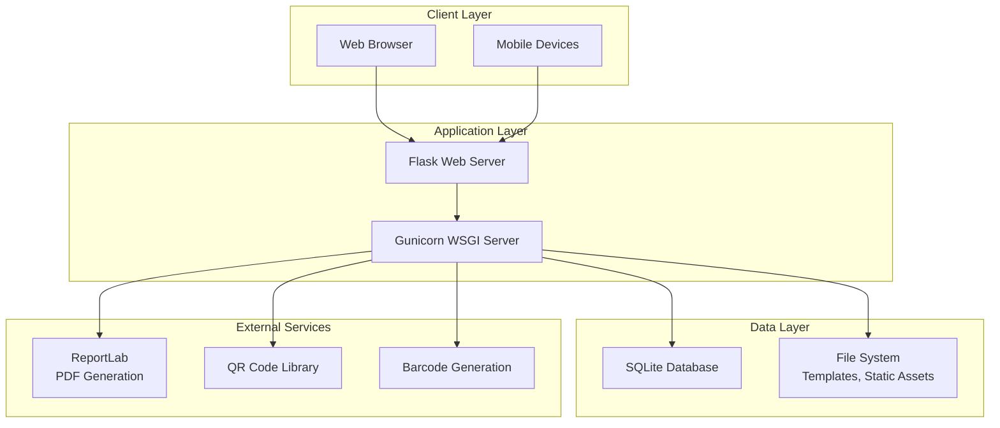

## Database Schema

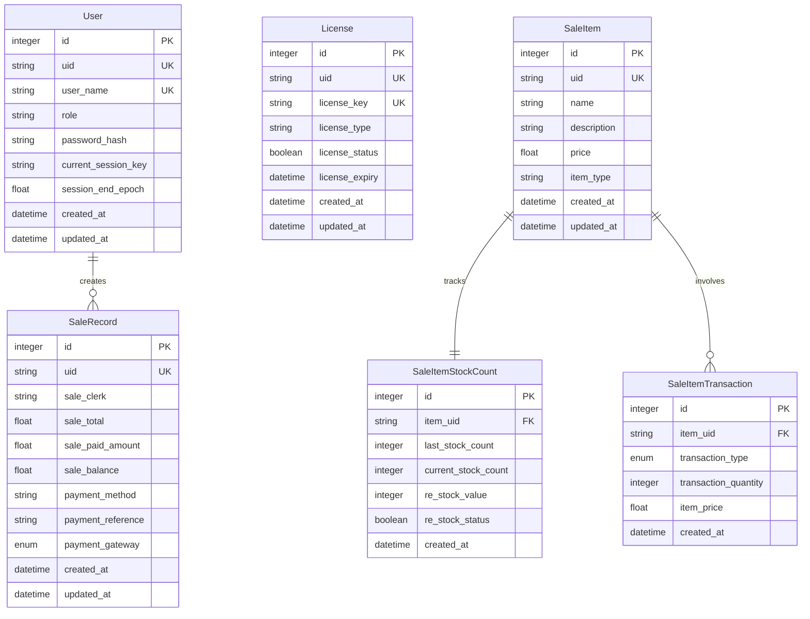

## User Roles and Permissions

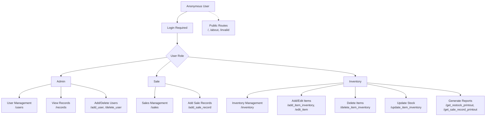

## Application Routes and Flow

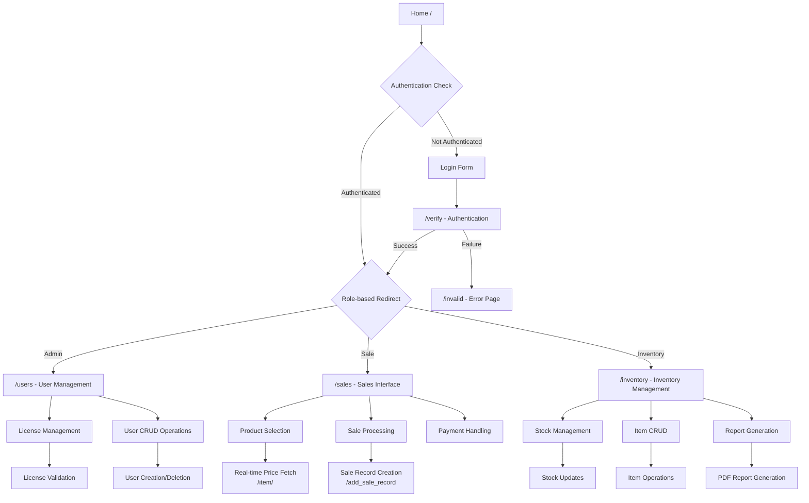

## Data Flow: Sales Transaction

```mermaid
sequenceDiagram
    participant U as User (Sale Role)
    participant F as Flask App
    participant DB as SQLite Database
    participant R as ReportLab

    U->>F: POST /add_sale_record
    F->>F: Parse JSON payload
    F->>DB: Create SaleItemTransaction records
    F->>DB: Update SaleItemStockCount (decrement)
    F->>DB: Create SaleRecord
    DB-->>F: Transaction committed
    F-->>U: Success response

    U->>F: GET /get_sale_record_printout
    F->>DB: Query SaleRecord data
    DB-->>F: Return sales data
    F->>R: Generate PDF report
    R-->>F: PDF file
    F-->>U: PDF download
```

## Data Flow: Inventory Management

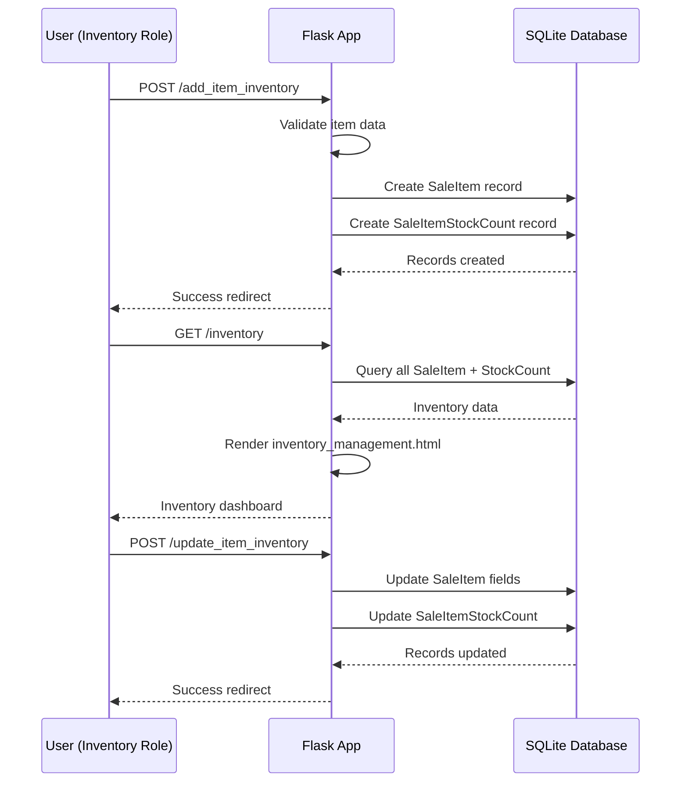

## Authentication Flow

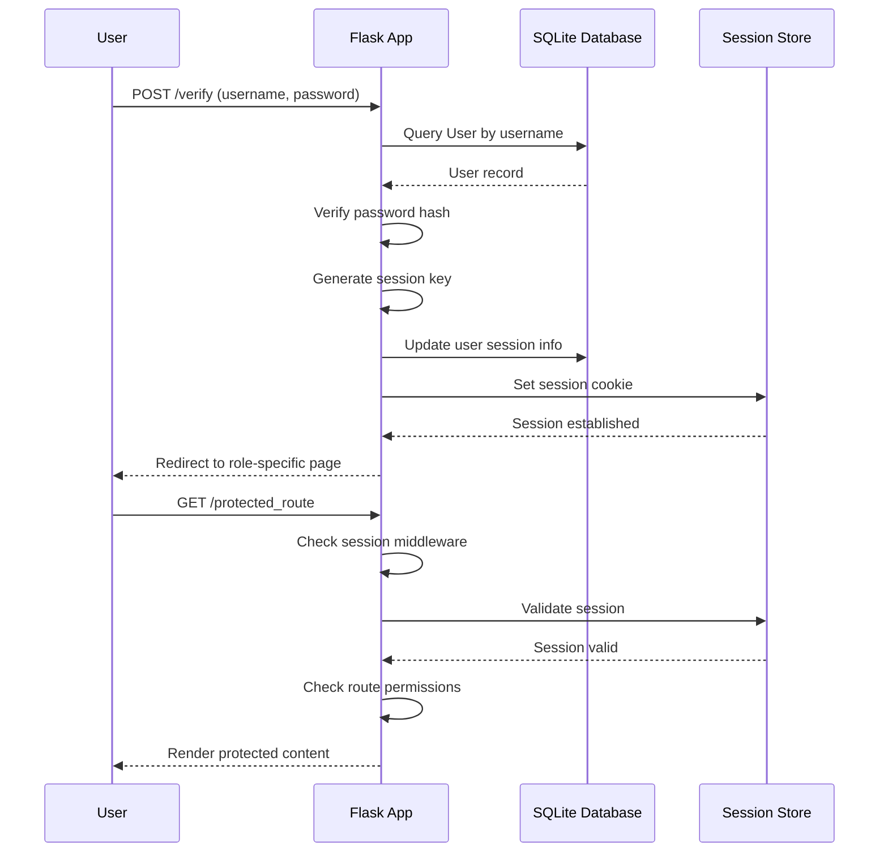

## License Management System

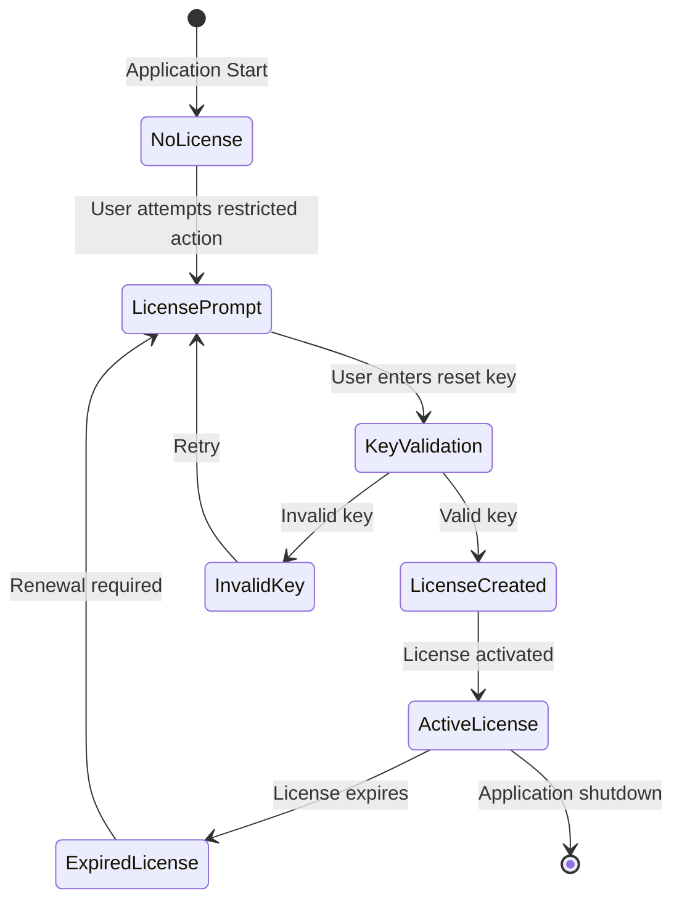

## Deployment Architecture

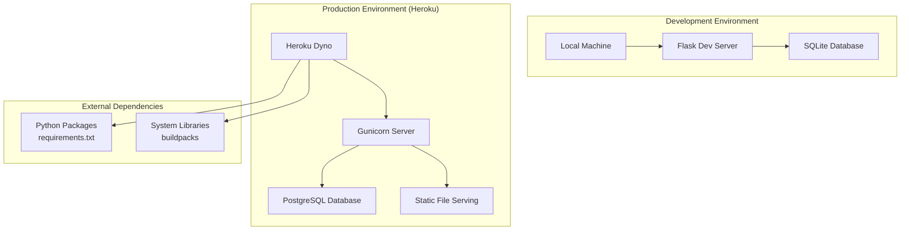

## Component Dependencies

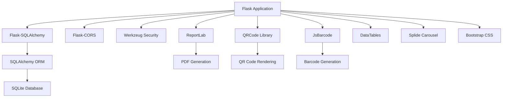

## Security Architecture

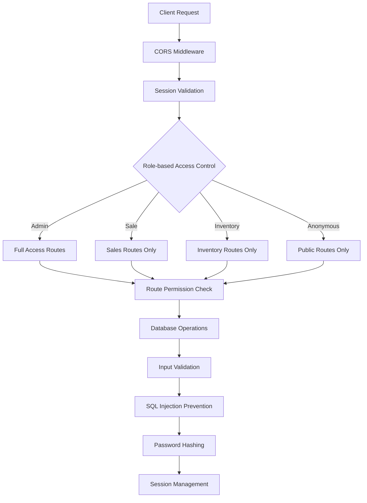

## Testing Architecture

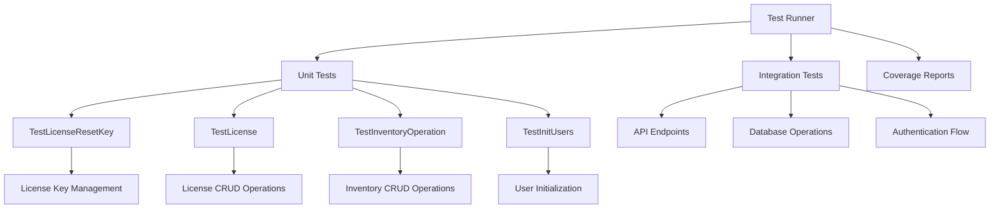

## Performance Considerations

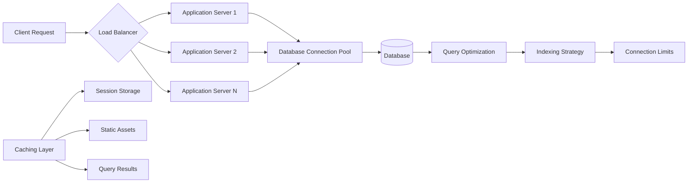

## Monitoring and Logging

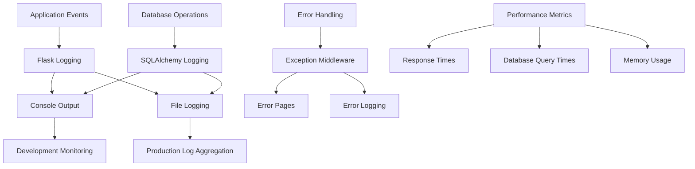

## Backup and Recovery

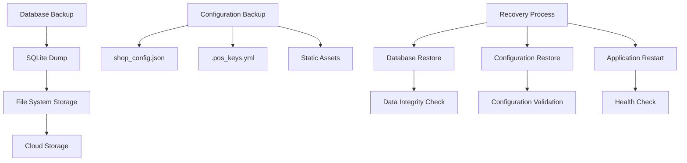

## Future Enhancements

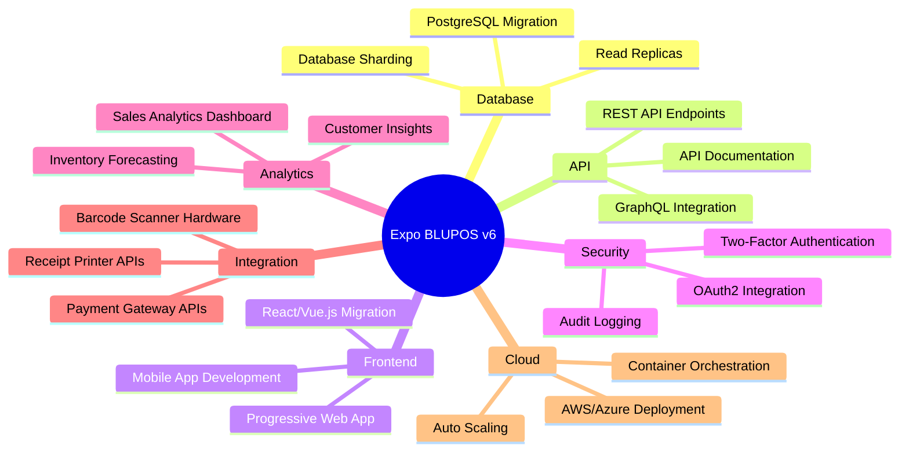

## Technology Stack Summary

| Component | Technology | Version | Purpose |
|-----------|------------|---------|---------|
| Backend Framework | Flask | 2.0.2 | Web application framework |
| Database ORM | SQLAlchemy | 1.4.27 | Database abstraction layer |
| Database | SQLite | - | Data persistence |
| WSGI Server | Gunicorn | 20.1.0 | Production server |
| PDF Generation | ReportLab | 4.0.4 | Report generation |
| QR Codes | qrcode | 7.4.2 | QR code generation |
| Barcodes | JsBarcode | - | Barcode generation |
| UI Framework | Bootstrap | - | Responsive design |
| Data Tables | DataTables | 1.13.6 | Interactive tables |
| Carousel | Splide | 3.1.2 | Image carousel |
| Authentication | Werkzeug | 2.0.2 | Password hashing |
| CORS | Flask-CORS | 3.0.10 | Cross-origin requests |
| Validation | Pydantic | 2.3.0 | Data validation |
| Configuration | YAML | 6.0.1 | Configuration files |

## Environment Configuration

### Development
- **Python**: 3.8+
- **Database**: SQLite (pos_test.db)
- **Server**: Flask development server
- **Port**: 5000 (default)

### Production
- **Platform**: Heroku
- **WSGI Server**: Gunicorn
- **Database**: SQLite (or PostgreSQL on Heroku)
- **Static Files**: Served by web server
- **Environment Variables**: Configured via Heroku dashboard

### Key Configuration Files
- `shop_config.json`: Shop-specific settings
- `.pos_keys.yml`: License reset keys
- `requirements.txt`: Python dependencies
- `Procfile`: Heroku deployment configuration

## API Endpoints Reference

| Endpoint | Method | Role Required | Description |
|----------|--------|---------------|-------------|
| `/` | GET | None | Home page |
| `/verify` | POST | None | User authentication |
| `/logout` | GET | Any | Session termination |
| `/users` | GET | Admin | User management dashboard |
| `/add_user` | POST | Admin | Create new user |
| `/delete_user` | POST | Admin | Delete user |
| `/sales` | GET | Sale | Sales interface |
| `/add_sale_record` | POST | Sale | Process sale transaction |
| `/inventory` | GET | Inventory | Inventory dashboard |
| `/add_item_inventory` | POST | Inventory | Add new inventory item |
| `/update_item_inventory` | POST | Inventory | Update inventory item |
| `/delete_item_inventory` | POST | Inventory | Delete inventory item |
| `/get_restock_printout` | GET | Inventory | Generate restock report |
| `/get_sale_record_printout` | GET | Inventory | Generate sales report |
| `/item/<uid>` | GET | Sale | Get item details for sale |

## Database Migration Path

For future database migrations from SQLite to PostgreSQL:

1. **Schema Export**: Use SQLAlchemy reflection to export current schema
2. **Data Export**: Export all data to JSON/CSV format
3. **Schema Creation**: Create PostgreSQL schema with proper constraints
4. **Data Import**: Import data with type conversions
5. **Testing**: Validate data integrity and application functionality
6. **Performance Tuning**: Add appropriate indexes and optimize queries

## Conclusion

Expo BLUPOS v5 represents a robust, scalable POS solution with comprehensive features for retail management. The modular architecture supports easy maintenance and future enhancements, while the role-based security ensures appropriate access controls. The system's use of modern web technologies and comprehensive testing suite ensures reliability and maintainability.
