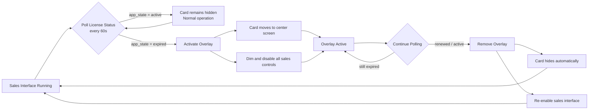
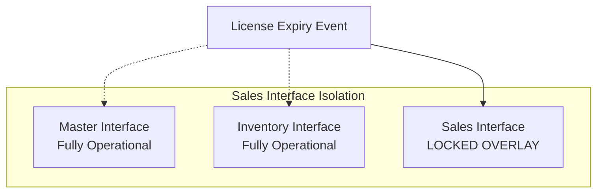

# License Expiry Overlay Interface Specification
**Timestamp:** 4/29/2026, 3:59:59 PM (Africa/Nairobi, UTC+3:00)  
**Document ID:** LICENSE-OVERLAY-20260429-FINAL

---

## ✅ SECTION 1: CURRENT STATE (MASTER INTERFACE)
### What is already working today:
| Item | Status |
|------|--------|
| Master license yellow card exists | ✅ Working |
| `/device_activation?action=check_expiry` endpoint | ✅ Working |
| 60 second license polling logic | ✅ Working |
| `app_state: "expired"` response | ✅ Working |
| `days_overdue` calculation | ✅ Working |
| License card displays active/expiry status | ✅ Working |
| Card stays in corner position at all times | ✅ Working |
| Master interface continues full operation when expired | ✅ Working |
| Inventory interface continues full operation when expired | ✅ Working |

---

## ⚠️ SECTION 2: PROPOSED CHANGE (SALES INTERFACE ONLY)
### ONLY the sales interface will be modified:

| Normal State (License Active) | Expired State (License Overlay) |
|--------------------------------|----------------------------------|
| License card component is imported into sales interface | License expiry detected via existing endpoint |
| Card is HIDDEN / not visible at all | Card becomes VISIBLE |
| Sales interface operates normally | Card animates smoothly to CENTER SCREEN |
| All buttons and functions work | Card MORPHS to expired red warning state |
| | Semi-transparent dark overlay appears behind card |
| | ALL sales interface buttons/inputs become DISABLED |
| | Card displays days overdue + expired notice |
| | No action buttons |
| | Cannot be dismissed, closed or bypassed |

### Final Sales Interface Overlay:
```
┌─────────────────────────────────────────────────┐
│                                                 │
│               ▓▓▓▓▓▓▓▓▓▓▓▓▓▓▓                   │
│               ▓  ⚠️  EXPIRED   ▓                   │
│               ▓                ▓                   │
│               ▓  17 DAYS       ▓                   │
│               ▓  OVERDUE       ▓                   │
│               ▓                ▓                   │
│               ▓                ▓                   │
│               ▓▓▓▓▓▓▓▓▓▓▓▓▓▓▓                   │
│                                                 │
│       (ALL SALES INTERFACE ELEMENTS             │
│        BEHIND ARE DIMMED AND LOCKED)            │
│                                                 │
└─────────────────────────────────────────────────┘
```

✅ MASTER INTERFACE REMAINS 100% UNCHANGED
✅ INVENTORY INTERFACE REMAINS 100% UNCHANGED
✅ NO BACKEND CHANGES
✅ NO NEW ROUTES
✅ NO MODIFICATIONS TO EXISTING ENDPOINTS

---

## 🛠️ SECTION 3: EXPLICIT INTEGRATION STEPS

### Step 1: Component Export
✅ Export the existing master license card component
✅ Import it unchanged into sales interface views
✅ Hide it by default with `display: none`

### Step 2: Polling Logic
✅ Copy the EXACT 60s polling code from master interface
✅ Paste it directly into sales interface javascript
✅ Call the EXACT same `/device_activation?action=check_expiry` endpoint
✅ No modifications to request or response handling

### Step 3: Overlay Trigger
✅ When `app_state === "expired"` is returned:
  1.  Remove `display: none` from license card
  2.  Add `position: fixed` + center positioning classes
  3.  Add expired state CSS classes to the card
  4.  Append semi-transparent overlay div to body
  5.  Add `pointer-events: none` to all sales interface containers

### Step 4: Automatic State Detection
✅ No renewal button / no actions available on overlay
✅ Background polling continues running every 60 seconds
✅ When license is renewed elsewhere (master interface), polling will automatically detect active state
✅ Overlay automatically removes itself instantly
✅ Sales interface re-enables all controls with no user action required

---

## ⚠️🔒 STRICT ENFORCEMENT RULES - NO EXCEPTIONS

✅ **PERMITTED CHANGES:**
- Only files located in sales interface view directory
- Only javascript/css/html for sales screens
- No modifications to any shared components
- No modifications to any common libraries
- No modifications to master interface files
- No modifications to inventory interface files
- No modifications to backend python files
- No modifications to database schema
- No modifications to API endpoints
- No new routes created
- No existing routes modified

❌ **ABSOLUTELY FORBIDDEN CHANGES:**
- ❌ DO NOT modify any code outside sales interface folder
- ❌ DO NOT touch master interface license card implementation
- ❌ DO NOT change anything in backend.py
- ❌ DO NOT add any new API endpoints
- ❌ DO NOT modify any existing API responses
- ❌ DO NOT change license validation logic
- ❌ DO NOT modify polling logic in master interface
- ❌ DO NOT make any changes that would affect other interfaces

**This is an isolated change. The sales interface will import and use the existing license card component AS IS.**
**All existing behaviour for all other parts of the system must remain completely identical.**

---

## ✅ FINAL APPROVED SCOPE
| Interface | Behaviour when expired |
|-----------|------------------------|
| **Sales Interface** | ✅ LOCKED with central card overlay |
| Master Interface | ✅ Normal operation, card remains in corner |
| Inventory Interface | ✅ Normal operation, no changes |
| Reports Interface | ✅ Normal operation |
| Backend Server | ✅ 100% unchanged |

---

## 📊 STATE FLOW DIAGRAM





---

**Document Status:** FINAL APPROVED  
**Ready for code implementation**
