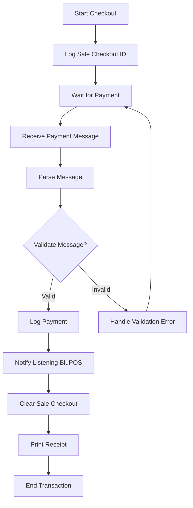
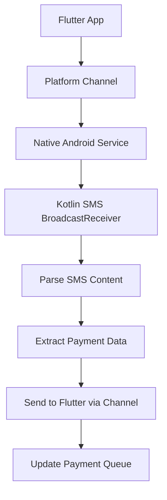

# Payment Extension APK Integration Flowchart

This document outlines the integration flow for the payment extension APK with the BluPOS system during checkout and payment reconciliation.

## Checkout and Payment Flow



## Detailed Steps

1. **Log Sale Checkout ID**: Record the unique identifier for the current sale transaction
2. **Wait for Payment**: System enters waiting state for payment completion
3. **Receive Payment Message**: Payment extension sends message with transaction details
4. **Parse Message**: Extract and process payment data from the received message
5. **Validate Message**: Verify the integrity and correctness of the payment message
   - If invalid, return to waiting state and handle error
   - If valid, proceed to logging
6. **Log Payment**: Record successful payment details in the system
7. **Notify Listening BluPOS**: Send confirmation to the main POS system
8. **Clear Sale Checkout**: Reset the checkout state for the completed transaction
9. **Print Receipt**: Generate and print the transaction receipt

## Product Backlog Update Context

This flow implements the payment integration requirements:
- Export base app for payment message parsing
- Integrate payment app with existing BluPOS checkout flow
- Handle the complete cycle from sale initiation to receipt printing

## Implementation Stages Based on Design Language

### Stage 1: Core APK Structure (Pages 1-3)
Based on the design language specifications, implement the three core pages:

#### Page1 (Activation)
- **UI Implementation**: Centered AppBar, rounded square container, activation button below
- **Functionality**:
  - Device activation form with input validation
  - Micro-server startup and status display
  - SMS permission request and handling
- **Endpoints**: `POST /api/activate` - Device activation with micro-server initialization

#### Page2 (Reports)
- **UI Implementation**: Centered AppBar, rounded square container, generate button below
- **Functionality**:
  - Transaction report generation and display
  - Data filtering and export capabilities
  - Background SMS parsing for transaction data
- **Endpoints**: `GET /api/reports` - Fetch transaction reports with filtering

#### Page3 (Wallet)
- **UI Implementation**: Centered AppBar, credit card style balance display, transaction list
- **Functionality**:
  - Real-time balance display from SMS parsing
  - Chronological transaction history
  - Manual transaction entry capabilities
- **Endpoints**: `GET /api/wallet/balance` - Current balance, `GET /api/wallet/transactions` - Transaction history

### Stage 2: Micro-Server Integration
- **Local HTTP Server**: Implement lightweight server for peer-to-peer communication
- **API Endpoints**: RESTful endpoints for data synchronization
- **Background Service**: Persistent server operation with battery optimization
- **Security**: Basic authentication and encrypted channels

### Stage 3: SMS Parsing Integration (Platform Channels)

**⚠️ IMPORTANT: Custom Platform Channels Required**

The current `flutter_sms` package is designed for **sending** SMS only. For proper SMS validation and monitoring, we need to implement custom platform channels with native Android code.

#### Platform Channel Architecture



#### Required Native Android Components

**1. SMS BroadcastReceiver (Kotlin)**
```kotlin
// android/app/src/main/java/com/blupos/wallet/SmsReceiver.kt
class SmsReceiver : BroadcastReceiver() {
    override fun onReceive(context: Context, intent: Intent) {
        if (intent.action == "android.provider.Telephony.SMS_RECEIVED") {
            val bundle = intent.extras
            if (bundle != null) {
                val pdus = bundle.get("pdus") as Array<*>?
                if (pdus != null) {
                    for (pdu in pdus) {
                        val smsMessage = SmsMessage.createFromPdu(pdu as ByteArray)
                        val sender = smsMessage.originatingAddress
                        val message = smsMessage.messageBody
                        
                        // Parse payment message
                        if (isPaymentMessage(message)) {
                            val paymentData = parsePaymentMessage(message, sender)
                            
                            // Send to Flutter via platform channel
                            sendPaymentToFlutter(paymentData)
                        }
                    }
                }
            }
        }
    }
    
    private fun isPaymentMessage(message: String): Boolean {
        // Detect payment confirmation messages
        val paymentKeywords = listOf("confirmed", "received", "payment", "M-PESA")
        return paymentKeywords.any { message.contains(it, ignoreCase = true) }
    }
    
    private fun parsePaymentMessage(message: String, sender: String?): PaymentData {
        // Extract amount, reference, sender
        val amountPattern = Regex("""KES\s*([\d,]+\.\d{2})""")
        val refPattern = Regex("""Ref:\s*(\w+)""")
        
        val amountMatch = amountPattern.find(message)
        val refMatch = refPattern.find(message)
        
        return PaymentData(
            amount = amountMatch?.groupValues?.get(1)?.replace(",", "")?.toDoubleOrNull() ?: 0.0,
            reference = refMatch?.groupValues?.get(1) ?: "",
            sender = sender ?: "",
            message = message,
            timestamp = System.currentTimeMillis()
        )
    }
}
```

**2. Platform Channel Handler (Kotlin)**
```kotlin
// android/app/src/main/java/com/blupos/wallet/SmsChannelHandler.kt
class SmsChannelHandler(private val context: Context) {
    private val channel = MethodChannel(
        (context as Activity).flutterEngine?.dartExecutor,
        "com.blupos.wallet/sms"
    )
    
    init {
        channel.setMethodCallHandler { call, result ->
            when (call.method) {
                "startSmsMonitoring" -> {
                    startSmsMonitoring()
                    result.success(true)
                }
                "stopSmsMonitoring" -> {
                    stopSmsMonitoring()
                    result.success(true)
                }
                "getSmsPermissions" -> {
                    checkPermissions()
                    result.success(true)
                }
                else -> result.notImplemented()
            }
        }
    }
    
    private fun startSmsMonitoring() {
        // Register SMS receiver
        val intentFilter = IntentFilter("android.provider.Telephony.SMS_RECEIVED")
        intentFilter.priority = IntentFilter.SYSTEM_HIGH_PRIORITY
        context.registerReceiver(SmsReceiver(), intentFilter)
    }
    
    private fun stopSmsMonitoring() {
        try {
            context.unregisterReceiver(SmsReceiver())
        } catch (e: IllegalArgumentException) {
            // Receiver not registered
        }
    }
    
    private fun sendPaymentToFlutter(paymentData: PaymentData) {
        channel.invokeMethod("onPaymentReceived", paymentData.toMap())
    }
}
```

**3. Flutter Platform Channel Integration**
```dart
// lib/services/sms_service.dart (Updated)
class SmsService extends ChangeNotifier {
  static const platform = MethodChannel('com.blupos.wallet/sms');
  
  // Start native SMS monitoring
  Future<void> startNativeSmsMonitoring() async {
    try {
      await platform.invokeMethod('startSmsMonitoring');
      _isListening = true;
      notifyListeners();
    } catch (e) {
      print('Error starting SMS monitoring: $e');
    }
  }
  
  // Stop native SMS monitoring
  Future<void> stopNativeSmsMonitoring() async {
    try {
      await platform.invokeMethod('stopSmsMonitoring');
      _isListening = false;
      notifyListeners();
    } catch (e) {
      print('Error stopping SMS monitoring: $e');
    }
  }
  
  // Setup platform channel listener
  void setupPlatformChannel() {
    platform.setMethodCallHandler((call) async {
      if (call.method == 'onPaymentReceived') {
        final paymentData = call.arguments as Map<String, dynamic>;
        _handleIncomingPayment(paymentData);
      }
    });
  }
  
  void _handleIncomingPayment(Map<String, dynamic> paymentData) {
    // Process payment and add to queue
    _paymentQueue.add(paymentData);
    _updateUnreadCount();
    notifyListeners();
  }
}
```

#### Android Manifest Updates
```xml
<!-- Add to AndroidManifest.xml -->
<uses-permission android:name="android.permission.RECEIVE_SMS" />
<uses-permission android:name="android.permission.READ_SMS" />

<application>
    <!-- SMS Receiver -->
    <receiver android:name=".SmsReceiver" 
              android:exported="true"
              android:permission="android.permission.BROADCAST_SMS">
        <intent-filter android:priority="1000">
            <action android:name="android.provider.Telephony.SMS_RECEIVED" />
        </intent-filter>
    </receiver>
</application>
```

#### Permission Management
```dart
// lib/services/permission_service.dart
class PermissionService {
  Future<bool> requestSmsPermissions() async {
    final status = await Permission.sms.request();
    return status.isGranted;
  }
  
  Future<bool> checkSmsPermissions() async {
    return await Permission.sms.isGranted;
  }
}
```

#### Implementation Steps

1. **Create Native Android Files**:
   - `SmsReceiver.kt` - SMS message detection and parsing
   - `SmsChannelHandler.kt` - Platform channel communication
   - Update `AndroidManifest.xml` with permissions and receiver

2. **Update Flutter Services**:
   - Modify `SmsService` to use platform channels
   - Add permission handling
   - Implement payment queue management

3. **Integration Points**:
   - Activation page requests SMS permissions
   - Wallet page starts/stops SMS monitoring
   - Payment queue widget receives parsed payments

#### Advantages of Platform Channels Approach

✅ **Real-time SMS Detection**: Native Android can detect SMS immediately
✅ **Background Processing**: Works even when app is in background
✅ **Proper Permissions**: Uses Android's native SMS permission system
✅ **Message Parsing**: Full control over SMS content parsing
✅ **Battery Efficient**: Native Android SMS handling is optimized
✅ **Security**: Proper Android permission model

#### Migration from flutter_sms

**Current Issues with flutter_sms**:
- Only supports sending SMS, not receiving
- No real-time monitoring capabilities
- Limited to foreground app usage
- Doesn't integrate with Android's SMS system properly

**Required Changes**:
1. Remove `flutter_sms` dependency from `pubspec.yaml`
2. Implement platform channels with native Android code
3. Update SMS service to use native monitoring
4. Add proper permission handling
5. Implement background SMS processing

#### Testing Strategy

1. **Unit Tests**: Test SMS parsing logic with sample messages
2. **Integration Tests**: Test platform channel communication
3. **Permission Tests**: Verify permission request flow
4. **Background Tests**: Test SMS detection when app is backgrounded
5. **Edge Cases**: Handle malformed SMS, spam messages, etc.

#### Security Considerations

- SMS permissions require user consent
- Payment message validation to prevent spoofing
- Secure storage of parsed payment data
- Rate limiting to prevent spam processing
- User confirmation before processing payments

### Stage 4: Payment Extension Integration
- **Message Parsing**: Handle payment extension APK communication
- **Transaction Recording**: Sync parsed payments with wallet
- **Receipt Generation**: Print receipts for completed transactions

## BluPOS API Endpoints Integration

### Core APK Endpoints (Micro-Server)
```
POST   /api/activate           - Device activation with server initialization
GET    /api/status             - Server status and connection info
GET    /api/wallet/balance     - Current wallet balance
GET    /api/wallet/transactions - Transaction history with pagination
POST   /api/wallet/transaction - Manual transaction entry
GET    /api/reports            - Transaction reports with date filtering
POST   /api/reports/export     - Export reports (PDF/CSV)
```

### Payment Extension Endpoints
```
POST   /api/payment/start      - Initiate payment checkout
POST   /api/payment/confirm    - Confirm payment receipt
GET    /api/payment/status     - Payment status polling
POST   /api/payment/cancel     - Cancel payment transaction
```

### SMS Integration Endpoints
```
GET    /api/sms/permissions     - Check SMS permissions status
POST   /api/sms/parse           - Manually trigger SMS parsing
GET    /api/sms/transactions    - Get parsed SMS transactions
POST   /api/sms/confirm         - Confirm parsed transaction
```

### Synchronization Endpoints
```
POST   /api/sync/transactions   - Sync transactions with BluPOS
GET    /api/sync/status         - Synchronization status
POST   /api/sync/manual         - Manual synchronization trigger
```

## APK Distribution and Download

### APK Build Availability in BluPOS Master Section

The compiled APK builds are made available for download through the BluPOS master system interface:

#### Download Locations
- **BluPOS Admin Panel**: Master section under "Mobile Extensions"
- **Direct URL Access**: `https://blupos-master.com/downloads/blupos-wallet.apk`
- **Version Management**: Automatic update notifications for new APK versions

#### APK Build Process
1. **Source Compilation**: APK built from `apk_section/` directory
2. **Signing**: Release builds signed with BluPOS certificate
3. **Version Tagging**: Semantic versioning (e.g., `v1.2.3`)
4. **Distribution**: Uploaded to BluPOS master download repository

#### Installation Requirements
- **Android Version**: API 24+ (Android 7.0)
- **Permissions**: SMS, Network, Storage access
- **Device Compatibility**: ARM64 and ARM32 architectures

## Activation Flow Integration

### APK Activation within BluPOS Ecosystem

The activation flow serves as the bridge between BluPOS master system and the mobile APK:

#### Activation Sequence
1. **APK Download**: User downloads APK from BluPOS master interface
2. **Installation**: Standard Android APK installation process
3. **First Launch**: APK opens to Page1 (Activation)
4. **Device Registration**: User enters activation code from BluPOS master
5. **Network Discovery**: APK automatically discovers BluPOS master IP
6. **Micro-Server Startup**: HTTP server initializes for peer-to-peer communication
7. **Permission Grants**: SMS and network permissions requested
8. **Synchronization**: Initial data sync with BluPOS master
9. **Activation Complete**: APK transitions to full wallet functionality

#### Activation Code Generation
- **BluPOS Master**: Generates unique activation codes per device
- **Code Format**: `BLU-{STORE_ID}-{DEVICE_ID}-{TIMESTAMP}`
- **Validation**: Server-side verification of code authenticity
- **Single Use**: Each code expires after successful activation

#### Network Auto-Discovery
```
BluPOS Master (192.168.1.100:8080)
    ↓ Broadcast
APK Device (Auto-discover)
    ↓ Connect
Handshake & Authentication
    ↓ Activate
Full System Integration
```

## Integration Flow with BluPOS

### Complete Transaction Flow
1. **APK Download & Activation**: Device downloads APK, completes activation flow
2. **Micro-Server Ready**: HTTP endpoints available for BluPOS communication
3. **Payment Initiation**: BluPOS sends checkout request to APK micro-server
4. **SMS Monitoring**: APK monitors SMS for payment confirmations
5. **Transaction Processing**: Parse SMS → Validate → User Confirmation → Record
6. **Synchronization**: Push transaction data to BluPOS via API
7. **Receipt Generation**: BluPOS generates and prints receipt
8. **Wallet Update** (Page3): Real-time balance and transaction updates
9. **Reports** (Page2): Historical transaction analysis and exports

## BluPOS Database Schema Updates

### New APK-Related Database Models

#### ApkDevice Model
```python
class ApkDevice(db.Model):
    id = db.Column(db.Integer, primary_key=True)
    device_uid = db.Column(db.String(16), unique=True, nullable=False)
    activation_code = db.Column(db.String(50), unique=True, nullable=False)
    device_name = db.Column(db.String(100))
    device_ip = db.Column(db.String(45))  # Support IPv6
    server_port = db.Column(db.Integer, default=8080)
    is_online = db.Column(db.Boolean, default=False)
    last_seen = db.Column(db.DateTime, default=datetime.utcnow)
    sms_permissions = db.Column(db.Boolean, default=False)
    micro_server_enabled = db.Column(db.Boolean, default=False)
    created_at = db.Column(db.DateTime, default=datetime.utcnow)
    activated_at = db.Column(db.DateTime, nullable=True)
```

#### ApkLicense Model
```python
class ApkLicense(db.Model):
    id = db.Column(db.Integer, primary_key=True)
    device_uid = db.Column(db.String(16), db.ForeignKey('apk_device.device_uid'), nullable=False)
    license_type = db.Column(db.String(20), nullable=False)  # "APK_BASIC", "APK_PREMIUM"
    license_status = db.Column(db.Boolean, default=True)
    license_expiry = db.Column(db.DateTime, nullable=False)
    sms_enabled = db.Column(db.Boolean, default=False)
    micro_server_enabled = db.Column(db.Boolean, default=True)
    created_at = db.Column(db.DateTime, default=datetime.utcnow)
```

#### SmsTransaction Model
```python
class SmsTransaction(db.Model):
    id = db.Column(db.Integer, primary_key=True)
    device_uid = db.Column(db.String(16), db.ForeignKey('apk_device.device_uid'), nullable=False)
    sms_sender = db.Column(db.String(20), nullable=False)
    sms_content = db.Column(db.Text, nullable=False)
    parsed_amount = db.Column(db.Float, nullable=True)
    parsed_reference = db.Column(db.String(50), nullable=True)
    transaction_confirmed = db.Column(db.Boolean, default=False)
    wallet_synced = db.Column(db.Boolean, default=False)
    received_at = db.Column(db.DateTime, default=datetime.utcnow)
    processed_at = db.Column(db.DateTime, nullable=True)
```

#### WalletTransaction Model
```python
class WalletTransaction(db.Model):
    id = db.Column(db.Integer, primary_key=True)
    device_uid = db.Column(db.String(16), db.ForeignKey('apk_device.device_uid'), nullable=False)
    transaction_type = db.Column(db.String(20), nullable=False)  # "SMS_PARSED", "MANUAL_ENTRY", "SYNC"
    amount = db.Column(db.Float, nullable=False)
    description = db.Column(db.String(255), nullable=False)
    reference = db.Column(db.String(50), nullable=True)
    balance_after = db.Column(db.Float, nullable=False)
    confirmed = db.Column(db.Boolean, default=False)
    created_at = db.Column(db.DateTime, default=datetime.utcnow)
    synced_at = db.Column(db.DateTime, nullable=True)
```

#### ApkReport Model
```python
class ApkReport(db.Model):
    id = db.Column(db.Integer, primary_key=True)
    device_uid = db.Column(db.String(16), db.ForeignKey('apk_device.device_uid'), nullable=False)
    report_type = db.Column(db.String(20), nullable=False)  # "TRANSACTIONS", "BALANCE", "SMS_HISTORY"
    report_data = db.Column(db.Text, nullable=False)  # JSON data
    generated_at = db.Column(db.DateTime, default=datetime.utcnow)
```

## APK Licensing Integration

### APK License Types
- **APK_BASIC**: Core wallet functionality, manual transaction entry, basic reports
- **APK_PREMIUM**: All BASIC features + SMS parsing, micro-server, advanced reports

### License Management Functions
```python
def generate_activation_code(store_id="BLU", device_id=None):
    """Generate activation code in format: BLU-{STORE_ID}-{DEVICE_ID}-{TIMESTAMP}"""
    if device_id is None:
        device_id = randomString(6)
    timestamp = datetime.now().strftime("%H%M%S")
    return f"{store_id}-{device_id}-{timestamp}"

def create_apk_device(device_name=None, device_ip=None):
    """Create a new APK device entry with activation code"""

def activate_apk_device(activation_code, device_ip=None):
    """Activate APK device and create license"""

def create_apk_license(device_uid, license_type="APK_BASIC"):
    """Create APK license linked to device"""
```

### License Validation
- APK licenses are separate from main BluPOS licenses
- Each APK device has its own license with specific feature flags
- SMS parsing and micro-server features controlled by license type
- License expiry managed independently of main system

## API Endpoints Extensions

### APK Management Endpoints (BluPOS Side)
```
GET    /api/apk/devices              - List all APK devices
POST   /api/apk/devices              - Register new APK device
GET    /api/apk/devices/{uid}        - Get device details
PUT    /api/apk/devices/{uid}        - Update device status
DELETE /api/apk/devices/{uid}        - Remove APK device

POST   /api/apk/activate             - Activate APK with code
GET    /api/apk/licenses             - List APK licenses
POST   /api/apk/licenses             - Create APK license
PUT    /api/apk/licenses/{id}        - Update APK license

GET    /api/apk/transactions         - Get APK wallet transactions
POST   /api/apk/sync                 - Sync APK data with BluPOS
GET    /api/apk/reports              - Get APK-generated reports
```

## Migration Strategy

### Database Migration Steps
1. **Add new tables** for ApkDevice, ApkLicense, SmsTransaction, WalletTransaction, ApkReport
2. **Update existing License model** if needed for APK integration
3. **Create foreign key relationships** between APK tables
4. **Add indexes** for performance on frequently queried fields
5. **Initialize APK license types** in existing license system

### Backward Compatibility
- Existing BluPOS functionality remains unchanged
- APK features are additive and optional
- Main license system continues to work for core POS features
- APK devices can be managed independently

## Technical Considerations

- Message parsing should handle various payment method responses
- Validation should include checksum verification and data integrity checks
- Notification to BluPOS should use established communication protocols
- Error handling should gracefully manage payment failures and retries
- Micro-server should implement automatic port allocation and conflict resolution
- SMS parsing should use battery-optimized background services
- All endpoints should support both HTTP and HTTPS with basic authentication
- APK licenses should be integrated with existing license reset key system
- Database relationships should maintain referential integrity
- API responses should include proper error handling and status codes
